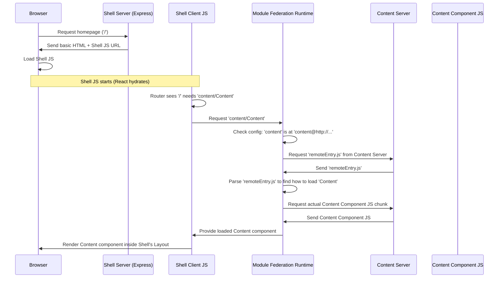

# Chapter 1: Shell Application (Host)

Welcome to the `cohbrgr` tutorial! We're excited to guide you through building a modern web application using microfrontends.

## What's the Big Idea? The Problem We're Solving

Imagine you're building a big, complex website – maybe an online store or a news portal. Different teams might work on different sections: one team for the product catalogue, another for the shopping cart, and yet another for the user profiles.

How do you bring all these separate parts together into one seamless website for the user? How do you make sure the website has a consistent look and feel, handles navigation between sections, and manages the basic setup like the web server?

Trying to build everything as one giant application (a "monolith") can become messy and slow down development. If Team A wants to update the product catalogue, they shouldn't have to wait for Team B to finish changes to the shopping cart.

This is where the **Shell Application** comes in!

## Meet the Shell: The Main Stage

Think of the Shell Application like the main stage and auditorium for a big show.

*   **The Auditorium & Stage (`Shell Application`):** It provides the physical structure (the building), the seating, the main stage, the lighting rig, and the sound system. This is the basic framework of your website – the overall page layout, the address bar navigation (routing), and the underlying web server.
*   **The Performers (`Microfrontends`):** These are the individual acts that come to perform on the stage – maybe a band, a magician, a comedian. In our web app, these are the independent parts like the product catalogue, shopping cart, or blog section. Each performer can practice and prepare separately.
*   **The Stage Manager (`Module Federation`):** This is the person who knows which act is performing when and makes sure they get on stage correctly. In our project, this role is played by a technology called [Module Federation Setup](03_module_federation_setup_.md), which helps the Shell load and display the different microfrontends.

So, the **Shell Application (Host)** is the main application that:

1.  Sets up the overall page structure (like headers, footers, main content area).
2.  Handles navigation (what happens when you click links or type URLs).
3.  Runs the basic web server ([Express Server & Middleware (Shell)](04_express_server___middleware__shell__.md)).
4.  Acts as the "host" that knows how to find and load other independent applications (we call these "remotes" or "microfrontends", like the [Content Application (Remote Microfrontend)](02_content_application__remote_microfrontend__.md)).

It's the primary application the user interacts with directly, orchestrating all the different pieces.

## How the Shell Works: A Simple Walkthrough

Let's see how the Shell brings in another part, like a simple content block.

1.  **User Visits:** You type the website's address (e.g., `http://localhost:3000/`) into your browser.
2.  **Server Responds:** The Shell's web server ([Express Server & Middleware (Shell)](04_express_server___middleware__shell__.md)) gets the request.
3.  **Basic Page:** The server sends back the basic HTML structure of the page. This might already include a header and footer defined by the Shell.
4.  **Shell Loads in Browser:** Your browser receives the HTML and starts loading the Shell's main JavaScript code.
5.  **Routing:** The Shell's JavaScript looks at the URL (`/`) and knows which components to display based on its routing rules. Let's say the homepage (`/`) needs to show a component from the separate 'content' application.
6.  **Fetching the Remote:** The Shell uses [Module Federation Setup](03_module_federation_setup_.md) to ask, "Hey, where can I find the 'content' application?". The configuration tells it the address (like `http://localhost:3031/`).
7.  **Loading the Component:** The Shell dynamically loads the necessary JavaScript code for the 'content' component from that address.
8.  **Display:** Once loaded, the Shell places the 'content' component into the designated area within its own layout (e.g., the main content area).

The user sees a complete page, seamlessly integrating parts from the Shell and the 'content' microfrontend, without necessarily knowing they came from different sources!

## Looking at the Code (Simplified)

Let's peek at some key parts of the `cohbrgr` Shell application (`apps/shell`). Don't worry if it looks complex; we'll break it down.

**1. Setting up the Basic Layout (`apps/shell/src/client/components/layout/Layout.tsx`)**

This is like building the stage structure. It's a simple React component that wraps the main content.

```typescript
// apps/shell/src/client/components/layout/Layout.tsx
import { FunctionComponent, ReactNode } from 'react';
// Import styles specific to the layout
import * as styles from './Layout.module.scss';

// Define expected properties (it needs children to display)
interface ILayout {
    children: ReactNode;
}

// The Layout component itself
const Layout: FunctionComponent<ILayout> = ({ children }) => {
    // It renders a div with a specific CSS class
    // and places whatever content (children) is passed to it inside
    return <div className={styles.layout}>{children}</div>;
};

export default Layout;
```

This component provides a container (`<div className={styles.layout}>...</div>`) where other content will be placed.

**2. Defining Routes (`apps/shell/src/client/routes.ts`)**

This file simply lists the different "pages" or paths the Shell knows about.

```typescript
// apps/shell/src/client/routes.ts
enum AppRoutes {
    start = '/',         // The homepage
    offline = '/offline', // A page shown when offline
    notFound = '*',      // A catch-all for unknown URLs
}

export default AppRoutes;
```

This helps organize the navigation within the Shell application.

**3. The Main Application Component (`apps/shell/src/client/App.tsx`)**

This component ties the layout and routing together and tells the Shell *where* to load the remote 'content' part.

```typescript
// apps/shell/src/client/App.tsx
import React, { lazy, Suspense } from 'react';
import { Route, Routes } from 'react-router-dom';
// Import shared components like the loading Spinner
import { Spinner } from '@cohbrgr/components';
// Import our layout and page components
import Layout from 'src/client/components/layout';
import NotFound from 'src/client/pages/not-found';
import Offline from 'src/client/pages/offline';
import AppRoutes from 'src/client/routes';

// *** Key Part: Importing the Remote Component ***
// lazy() + import() tells React to load this component dynamically.
// 'content/Content' is a special path configured via Module Federation.
const Content = lazy(() => import('content/Content'));

const App: React.FunctionComponent = () => {
    return (
        <Layout> {/* Use the main layout */}
            <Routes> {/* Define the routes */}
                <Route
                    path={AppRoutes.start} /* On the homepage... */
                    element={
                        /* Show a spinner while loading... */
                        <Suspense fallback={<Spinner />}>
                            {/* ...then show the Content component */}
                            <Content />
                        </Suspense>
                    }
                />
                {/* Other routes for offline/not found pages */}
                <Route path={AppRoutes.offline} element={<Offline />} />
                <Route path={AppRoutes.notFound} element={<NotFound />} />
            </Routes>
        </Layout>
    );
};

export default App;
```

*   `Layout`: Wraps everything, providing the consistent structure.
*   `Routes`/`Route`: Sets up the navigation based on the URL.
*   `lazy(() => import('content/Content'))`: This is the magic! It tells React and Module Federation: "When we need the `Content` component, load it from the remote application named `content`." The exact location of `content` is defined elsewhere in the build configuration.
*   `Suspense fallback={<Spinner />}`: Shows a loading indicator while the `Content` component is being fetched over the network.

**4. Telling the Shell Where to Find 'content' (`apps/shell/build/configs/rspack.federated.config.ts`)**

This configuration file is crucial for Module Federation. It tells the Shell the *name* and *address* of the remote applications it needs to load.

```typescript
// apps/shell/build/configs/rspack.federated.config.ts
import { ModuleFederationPlugin } from '@module-federation/enhanced/rspack';
// ... other imports ...
import packageJson from '../../../../package.json'; // Used for shared libraries

// Function to get Module Federation settings
const getHostOptions = (isServer: boolean) => {
    // Get the address of the content app (simplified)
    const contentUrl = 'http://localhost:3031/'; // Address of the content app

    return {
        name: 'shell', // This application's name

        // *** Key Part: Defining Remotes ***
        remotes: {
            // 'content' is the name we use in import('content/Content')
            // The value tells MF where to find its entry point.
            content: `content@${contentUrl}${isServer ? 'server' : 'client'}/remoteEntry.js`,
        },
        // Defines libraries shared between shell and remotes (more later)
        shared: [ /* ... shared dependencies ... */ ],
    };
};

// Export configuration for client and server builds
export default () => {
    return {
        client: new ModuleFederationPlugin({
            /* ... client-specific config ... */
            ...getHostOptions(false), // Use host options for client
        }),
        server: new ModuleFederationPlugin({
             /* ... server-specific config ... */
            ...getHostOptions(true), // Use host options for server
        }),
    };
};
```

The `remotes` object maps the internal name used in `import()` statements (`content`) to the actual location (`content@http://localhost:3031/client/remoteEntry.js`). This `remoteEntry.js` file acts like a directory for the remote application, telling the Shell what components are available and how to load them. We'll dive deeper into this in the [Module Federation Setup](03_module_federation_setup_.md) chapter.

**5. Starting the Client-Side App (`apps/shell/src/client/bootstrap.tsx`)**

This is the entry point for the Shell's code that runs in the user's browser. It takes the initial HTML sent by the server and makes it interactive using React.

```typescript
// apps/shell/src/client/bootstrap.tsx
import { StrictMode } from 'react';
import { hydrateRoot } from 'react-dom/client'; // Use hydrateRoot for SSR
import { BrowserRouter } from 'react-router-dom'; // Enable client-side routing

import App from 'src/client/App'; // Import the main App component

// Find the main container div in the HTML
const root = document.getElementById('root');

if (root) {
    // Make the server-rendered HTML interactive
    hydrateRoot(
        root,
        <StrictMode> {/* Helps find potential problems */}
            <BrowserRouter> {/* Manages browser history for routing */}
                <App /> {/* Render our main application */}
            </BrowserRouter>
        </StrictMode>,
    );
}
```

`hydrateRoot` attaches React to the existing HTML generated by the server (part of the [Server-Side Rendering (SSR) Pipeline](05_server_side_rendering__ssr__pipeline_.md)), making the page dynamic. `BrowserRouter` enables the client-side routing we saw in `App.tsx`.

## Under the Hood: How Loading Works (Simplified Flow)

Let's visualize how the Shell loads the `Content` component when you visit the homepage:



This diagram shows the collaboration:

*   The **Shell Server** provides the initial structure.
*   The **Shell Client JS** handles routing and requests components.
*   The **Module Federation Runtime** (part of the Shell's JS) manages finding and loading remote code.
*   The **Content Server** serves its specific code (`remoteEntry.js` and component chunks).

## Conclusion

You've now learned about the fundamental role of the **Shell Application (Host)**. It's the main container that sets up the stage, manages the overall structure, routing, and server, and crucially, knows how to dynamically load and integrate independent microfrontends like our 'content' example using Module Federation. It's the orchestrator ensuring all the separate pieces work together harmoniously.

In the next chapter, we'll flip the coin and look at the other side: the microfrontend itself.

Next Up: [Content Application (Remote Microfrontend)](02_content_application__remote_microfrontend__.md)

---

Generated by [AI Codebase Knowledge Builder](https://github.com/The-Pocket/Tutorial-Codebase-Knowledge)