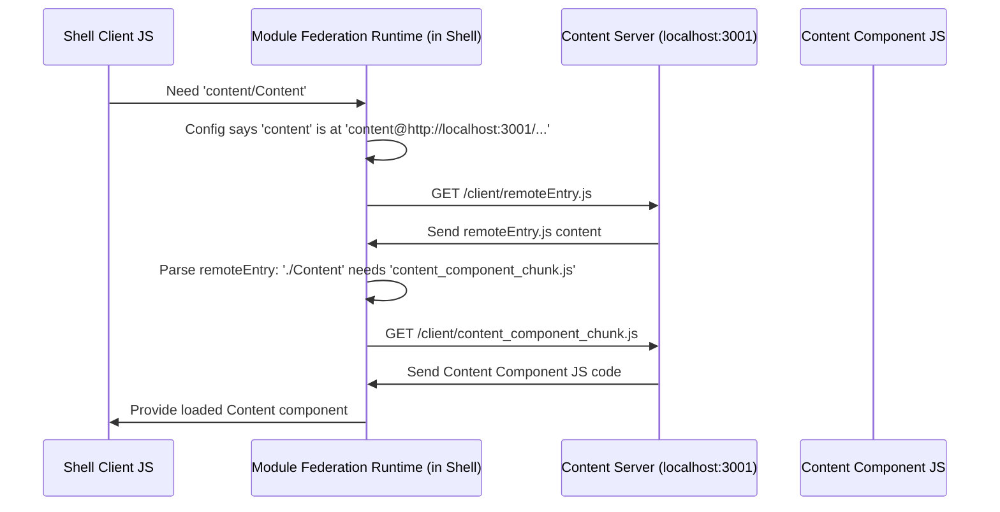

# Chapter 2: Content Application (Remote Microfrontend)

In the [Shell Application (Host)](01_shell_application__host__.md), we learned about the main stage (the Shell) that sets up the basic website structure and orchestrates everything. But who performs on this stage? That's where our Content Application comes in!

## What's the Big Idea? Independent Performers

Imagine our website is a music festival. The Shell is the main stage, sound system, and venue staff. Now, we need bands to actually play music!

The **Content Application** is like one of those bands.

*   **The Band (`Content Application`):** It has its own songs (the specific content, like the intro text and links on the homepage), its own instruments (its own code, like React components), and can practice independently.
*   **Performing on Stage (`Loaded by Shell`):** When it's showtime, the band comes onto the main stage (the Shell) to perform for the audience. The venue staff (Shell) doesn't write the band's songs, but it provides the place for them to be heard.

So, the **Content Application (Remote Microfrontend)** is:

1.  **A Microfrontend:** A smaller, focused piece of the overall website UI. In this case, it's responsible *only* for displaying the main content block on the homepage.
2.  **Remote:** It's designed to be loaded *from* the Shell application, often running on a different port during development (like `http://localhost:3001` while the Shell is on `http://localhost:3000`). It has its own separate build process and could even be deployed independently.
3.  **Exposes Components:** It makes specific parts of itself (like its main `Content` component) available for other applications (like the Shell) to use.

This independence is key! The team working on the Content Application can update the homepage text or links without needing to coordinate deeply with the team managing the Shell's header or footer.

## How the Content App Gets on Stage

Let's revisit the flow from the Shell's perspective, now focusing on the Content app's role:

1.  **Shell Needs Content:** The Shell's routing decides it needs to display the component exposed by the 'content' application (remember `import('content/Content')`?).
2.  **Shell Asks:** Using [Module Federation Setup](03_module_federation_setup_.md), the Shell asks, "Where can I find the code for the 'content' app's `Content` component?"
3.  **Content App Responds:** The Content app (running separately, maybe on `localhost:3001`) has a special `remoteEntry.js` file (like a directory or menu) that tells the Shell, "Here's how you can load my `Content` component."
4.  **Shell Loads:** The Shell fetches the necessary JavaScript code for the `Content` component directly from the Content app's address.
5.  **Shell Displays:** The Shell then renders the fetched `Content` component within its own layout.

The Content app simply needs to be running and ready to serve its parts when the Shell asks for them.

## Looking at the Code (Simplified)

Let's peek inside the `apps/content` folder.

**1. The Main Content Component (`apps/content/src/client/components/content/Content.tsx`)**

This is the actual "performance" – the UI that the Content app provides. It's a standard React component.

```typescript
// apps/content/src/client/components/content/Content.tsx
import { Navigation } from '@cohbrgr/components'; // Shared navigation component
import { FunctionComponent } from 'react';

// The component that displays the main page info
const Content: FunctionComponent = () => {
    return (
        <> {/* React fragment to group elements */}
            <main>
                <h1>My name is Christian</h1>
                <p>
                    I am a Frontend Developer...
                    {/* More text and links */}
                </p>
            </main>
            {/* Uses a shared Navigation component */}
            <Navigation>
                <a href="...">Github</a>
                {/* More links */}
            </Navigation>
        </>
    );
};

export default Content; // Make this component available for export
```

This code defines what the user sees in the main content area: a heading, a paragraph, and some navigation links. It doesn't worry about the overall page header or footer; that's the Shell's job.

**2. Making the Component Available (`apps/content/src/client/components/content/index.ts`)**

Often, components are exported via an `index.ts` file in their directory for cleaner imports.

```typescript
// apps/content/src/client/components/content/index.ts
import Content from './Content'; // Import the component

export default Content; // Export it as the default export
```

This simply re-exports the `Content` component we just saw.

**3. The Content App's Wrapper (`apps/content/src/client/App.tsx`)**

Similar to the Shell, the Content app might have a top-level `App` component, although here it's very simple.

```typescript
// apps/content/src/client/App.tsx
import { FunctionComponent } from 'react';
// Import the component we want to expose
import Content from 'src/client/components/content';

// This App component just renders the Content component
const App: FunctionComponent = () => {
    return <Content />;
};

export default App;
```

In this simple case, it just renders the main `Content` component. In more complex microfrontends, this `App` might set up context providers or routing specific *to that microfrontend*.

**4. Telling the World What's Available (`apps/content/build/configs/rspack.federated.config.ts`)**

This is the key configuration for Module Federation *within the Content app*. It defines what this app "exposes" to others.

```typescript
// apps/content/build/configs/rspack.federated.config.ts
import { ModuleFederationPlugin } from '@module-federation/enhanced/rspack';
// ... other imports ...

const getRemoteOptions = () => {
    return {
        name: 'content', // The unique name of this remote app
        filename: 'remoteEntry.js', // The manifest file others will load

        // *** Key Part: What this app SHARES ***
        exposes: {
            // './Content' is the alias others will use (e.g., 'content/Content')
            // 'src/client/components/content' is the actual file path inside this app
            './Content': 'src/client/components/content',
        },
        // Defines libraries shared with the Shell (more later)
        shared: { /* ... react, react-dom ... */ },
    };
};

// Export configuration for client and server builds
export default () => {
    return {
        client: new ModuleFederationPlugin(getRemoteOptions()),
        server: new ModuleFederationPlugin({ /* ... server config ... */ }),
    };
};
```

*   `name: 'content'`: Gives this microfrontend a unique identifier.
*   `filename: 'remoteEntry.js'`: Specifies the name of the file the Shell will fetch first to understand what's available.
*   `exposes: { './Content': '...' }`: This is crucial! It creates a mapping. It says, "If someone asks for `'./Content'` (which the Shell combines with the remote name to form `content/Content`), give them the code from my local file `src/client/components/content/index.ts`."

**5. Starting the Content App (If Run Standalone) (`apps/content/src/client/bootstrap.tsx`)**

Like the Shell, the Content app has a `bootstrap.tsx` file. This is primarily used if you wanted to run and view the Content app completely on its own during development (though in our setup, it's usually loaded *by* the Shell).

```typescript
// apps/content/src/client/bootstrap.tsx
import { StrictMode } from 'react';
import { hydrateRoot } from 'react-dom/client';
import App from 'src/client/App'; // The simple App wrapper

// Find the container div (might not exist if loaded by Shell)
const root = document.getElementById('content');

// If running standalone and the div exists...
if (root) {
    // Render the Content app into that div
    hydrateRoot(
        root,
        <StrictMode>
            <App />
        </StrictMode>,
    );
}
```

This code tries to find an HTML element with the ID `content` and render the `App` component into it. When the Shell loads this component, it doesn't typically rely on this bootstrap; it directly uses the component provided via Module Federation.

## Under the Hood: Serving the Content

The Content app is truly independent – it even has its own simple web server (using Express, just like the Shell, but much simpler) to serve its own files during development.

**1. Independent Server (`apps/content/src/server/index.ts`)**

This server's main job is to make the Content app's built JavaScript files (including `remoteEntry.js`) available over the network so the Shell can fetch them.

```typescript
// apps/content/src/server/index.ts
import Express from 'express';
// ... other imports (Logger, Config) ...

const port = 3001; // Runs on a different port than the Shell!
const app = Express();

// Middleware to serve static files (the built JS)
// ... app.use(...) configuration ...

// Start the server
app.listen(port, () => {
    console.log(`Content app server started at http://localhost:${port}`);
});
```

This lightweight server listens on port `3001` and serves the files generated by the Content app's build process ([Rspack Build Configuration](06_rspack_build_configuration_.md)).

**2. How the Shell Gets the Code (Simplified Flow)**



This shows the Content Server (`CS`) simply responding to requests from the Shell's Module Federation Runtime (`MFR`) for the necessary files.

## Conclusion

You've now met the first "performer" in our microfrontend show: the **Content Application**. It's an independent unit responsible for a specific piece of the UI (the main page content).

Key takeaways:

*   It's a **microfrontend** (small, focused UI part).
*   It runs **remotely** (separate process, potentially separate server).
*   It **exposes** specific components (like `Content`) using Module Federation configuration.
*   The **Shell** dynamically loads these exposed components when needed.

This separation allows teams to work independently and deploy parts of the application without affecting others.

Next, we'll dive into the magic that connects the Shell and the Content app: Module Federation itself.

Next Up: [Module Federation Setup](03_module_federation_setup_.md)

---

Generated by [AI Codebase Knowledge Builder](https://github.com/The-Pocket/Tutorial-Codebase-Knowledge)