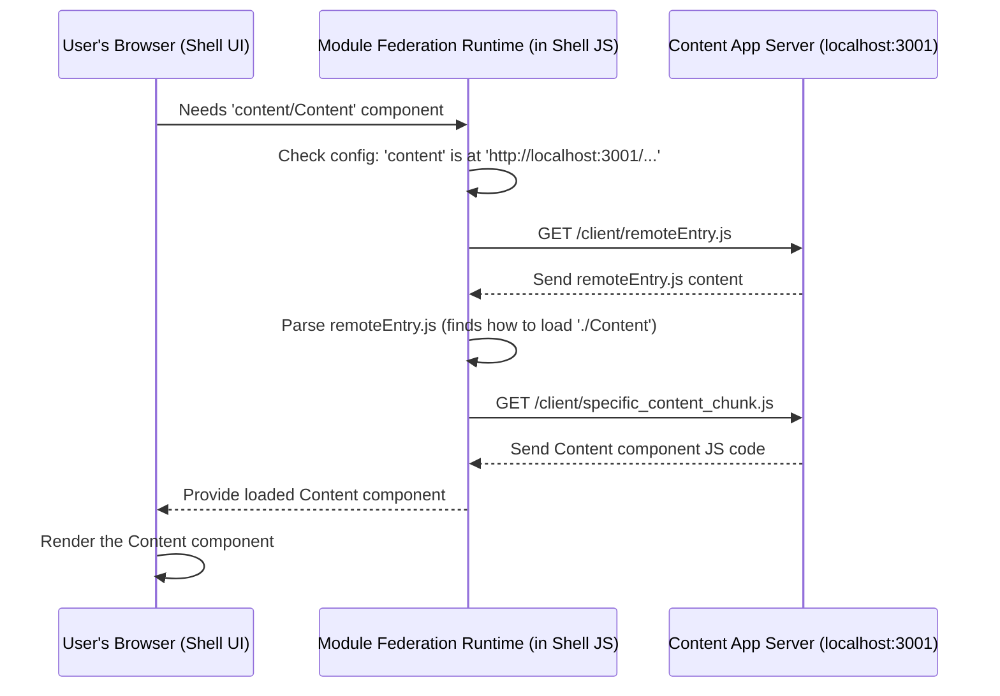

# Chapter 3: Module Federation Setup

In the previous chapters, we met the [Shell Application (Host)](01_shell_application__host__.md), which is like our main stage, and the [Content Application (Remote Microfrontend)](02_content_application__remote_microfrontend__.md), which is like an independent performer.

But how does the Shell know where to find the Content app? How do they connect and maybe even share common tools (like the React library) without bringing duplicates? That's the job of **Module Federation**!

## What's the Big Idea? Connecting the Lego Bricks

Imagine you have two separate Lego creations: a cool baseplate (our Shell) and a specific structure like a small house (our Content). You want to plug the house onto the baseplate.

Module Federation is like the special connector studs and sockets on the Lego bricks:

1.  **Connecting:** It defines *how* the house (Content) plugs into the baseplate (Shell).
2.  **Sharing Bricks:** If both the baseplate and the house need the same common red 2x4 brick (like the React library), Module Federation helps them share *one* brick instead of each bringing their own duplicate. This saves space and ensures consistency.

So, Module Federation Setup defines how our independent Shell and Content applications:

*   **Connect at Runtime:** They find and load code from each other directly in the user's browser (or on the server).
*   **Share Code:** They avoid loading multiple copies of the same shared libraries (like React).
*   **Stay Independent:** They can still be developed and deployed separately.

## Key Concepts: The Players in the Game

Module Federation involves a few key ideas:

*   **Host (e.g., Shell):** The application that loads code *from* other applications. It acts as the main container.
*   **Remote (e.g., Content):** An application that *exposes* parts of itself to be loaded by Hosts. It's a provider of features or components.
*   **Exposing:** A Remote application decides which of its internal code modules (like components) it wants to make available to others. It lists these in its configuration.
*   **Remotes (Configuration):** A Host application needs a list of the Remotes it might want to load code from, including their names and network addresses.
*   **Shared Dependencies:** Both Hosts and Remotes declare common libraries (like `react`, `react-dom`) they use. Module Federation tries to ensure only one copy of each shared library (that meets the version requirements) is loaded.
*   **`remoteEntry.js`:** Think of this as a menu or directory file automatically generated for a Remote. When a Host wants to load something from a Remote, it first fetches this file to see what's available and how to get it.

## How It Works: Configuring the Connection

The magic happens in specific configuration files used during the build process ([Rspack Build Configuration](06_rspack_build_configuration_.md)). Let's look at simplified snippets from our `cohbrgr` project.

**1. Content App: "Here's what I offer!" (`apps/content/build/configs/rspack.federated.config.ts`)**

The Content app needs to declare its name and what components it wants to share (expose).

```typescript
// Simplified from apps/content/.../rspack.federated.config.ts
import { ModuleFederationPlugin } from '@module-federation/enhanced/rspack';
// ... other imports ...

const remoteOptions = {
    // 1. Give this remote app a unique name
    name: 'content',
    // 2. Define the 'menu' filename
    filename: 'remoteEntry.js',

    // 3. List what components are exposed
    exposes: {
        // Key: Alias used by others (e.g., 'content/Content')
        // Value: Actual path inside this app
        './Content': 'src/client/components/content',
    },
    // 4. List shared libraries (like React)
    shared: {
        react: { /* config for react */ },
        'react-dom': { /* config for react-dom */ },
    },
};

export default () => ({
    // Apply these options using the plugin
    client: new ModuleFederationPlugin(remoteOptions),
    // server config is similar...
});
```

*   `name: 'content'`: Declares the unique name for this remote.
*   `filename: 'remoteEntry.js'`: Specifies the name for the "menu" file.
*   `exposes: { './Content': ... }`: Makes the local component at `src/.../content` available under the alias `./Content`. The Host will combine the remote name and this alias to import it as `content/Content`.
*   `shared: { ... }`: Lists libraries like React that it hopes to share with the Host.

**2. Shell App: "I need these remotes!" (`apps/shell/build/configs/rspack.federated.config.ts`)**

The Shell app needs to know the names and addresses of the remotes it wants to use.

```typescript
// Simplified from apps/shell/.../rspack.federated.config.ts
import { ModuleFederationPlugin } from '@module-federation/enhanced/rspack';
// ... other imports ...

const hostOptions = {
    // 1. Give this host app a name (optional but good practice)
    name: 'shell',

    // 2. List the remotes it knows about
    remotes: {
        // Key: Name used in imports (e.g., import('content/...'))
        // Value: Where to find the remote's 'menu' file
        content: 'content@http://localhost:3001/client/remoteEntry.js',
    },
    // 3. List shared libraries (must match Remote's shared list)
    shared: {
        react: { /* config for react */ },
        'react-dom': { /* config for react-dom */ },
    },
};

export default () => ({
    // Apply these options using the plugin
    client: new ModuleFederationPlugin(hostOptions),
    // server config is similar...
});
```

*   `remotes: { content: '...' }`: Tells the Shell that code requested from `content` (like `import('content/Content')`) can be found by looking at the `remoteEntry.js` file served at `http://localhost:3001/client/remoteEntry.js`. The `content@` part specifies the global scope name expected by the remote entry file.
*   `shared: { ... }`: Lists libraries the Shell uses, allowing Module Federation to potentially share them with the `content` remote if versions are compatible.

With these configurations in place, when the Shell app's code executes `import('content/Content')`, Module Federation knows exactly where to go to fetch the code for the `Content` component.

## Under the Hood: The Connection Flow

Let's trace what happens when the Shell needs to load the `Content` component for the first time.

1.  **Shell Code Runs:** The Shell's JavaScript (running in the browser) hits the line `lazy(() => import('content/Content'))`.
2.  **Module Federation Checks Config:** The Module Federation runtime (part of the Shell's code) sees the `content` prefix. It looks up `content` in its `remotes` configuration.
3.  **Finds Remote Address:** It finds the address: `http://localhost:3001/client/remoteEntry.js`.
4.  **Fetches "Menu":** The browser makes a network request to fetch the `remoteEntry.js` file from the Content application's server (running on port 3001).
5.  **Parses "Menu":** The Module Federation runtime receives and parses `remoteEntry.js`. This file contains information on how to get the specific `Content` module (it knows which actual JavaScript file chunk contains the code).
6.  **Fetches Component Code:** The browser makes another network request (if needed) to the Content application's server to get the specific JavaScript file(s) containing the `Content` component code.
7.  **Executes Code:** The fetched code is executed.
8.  **Component Ready:** The `Content` component is now available for the Shell to render.

Here's a simplified diagram of the network requests involved:



This shows how the Shell (via the MF Runtime) communicates with the Content Server to dynamically fetch the code it needs, exactly when it needs it. The crucial part is the configuration that tells the Shell *where* to look (`remotes`) and the Content app *what* to offer (`exposes`).

## Conclusion

Module Federation is the powerful technology that acts as the "glue" connecting our independent Shell and Content applications. It allows the Shell (Host) to dynamically load code from the Content app (Remote) at runtime.

You learned:

*   Hosts use `remotes` config to find Remotes.
*   Remotes use `exposes` config to share specific modules.
*   `shared` config helps avoid duplicate libraries like React.
*   The `remoteEntry.js` file acts as a directory for the Remote's exposed code.

This setup enables true microfrontend architecture, where different parts of the application can be developed, deployed, and loaded independently, but still work together seamlessly for the user.

In the next chapter, we'll look more closely at the web server running inside the Shell application, which handles incoming user requests and starts the whole process.

Next Up: [Express Server & Middleware (Shell)](04_express_server___middleware__shell__.md)

---

Generated by [AI Codebase Knowledge Builder](https://github.com/The-Pocket/Tutorial-Codebase-Knowledge)