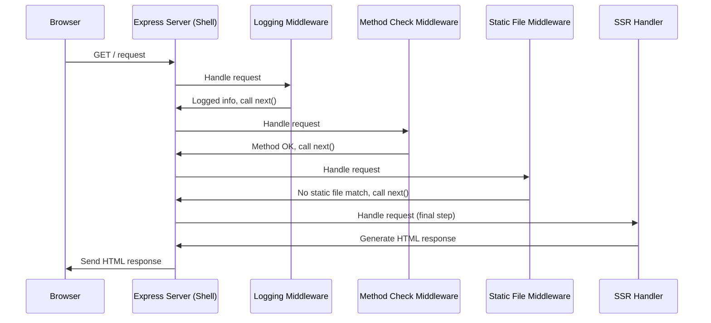

# Chapter 4: Express Server & Middleware (Shell)

In the previous chapter, we learned how [Module Federation Setup](03_module_federation_setup_.md) acts like special connectors, allowing our [Shell Application (Host)](01_shell_application__host__.md) and [Content Application (Remote Microfrontend)](02_content_application__remote_microfrontend__.md) to plug into each other and share code.

But how does a user's request from their web browser actually *reach* our Shell application in the first place? And how does the Shell handle different tasks before showing the user a page? This is where the **Express Server & Middleware** comes in!

## What's the Big Idea? The Building's Front Desk

Imagine our Shell application is a large, busy building. When someone wants to visit (i.e., a user types your website address in their browser), they don't just magically appear inside. They first need to go through the entrance and interact with the front desk staff.

The **Express Server** is like the building itself and the main concierge desk. It's the first point of contact for all visitors (incoming web requests).

**Middleware** functions are like the different staff members or procedures at the front desk:

*   **Greeter:** Logs who is visiting (`logging` middleware).
*   **Security Guard:** Checks if the visitor is allowed (e.g., checking the request type with `methodDetermination`).
*   **Efficiency Expert:** Compresses things to make them faster (`compression` middleware).
*   **Information Desk:** Quickly hands out common items like brochures or maps (serving static files like CSS or basic JavaScript with `express.static`).
*   **Security Scanner:** Performs checks like rate limiting or setting security headers.
*   **Guide:** Finally directs the visitor to their actual destination within the building (triggering the [Server-Side Rendering (SSR) Pipeline](05_server_side_rendering__ssr__pipeline_.md)).

So, the Express Server and its Middleware work together to:

1.  **Listen for Requests:** Wait for users to connect to our application's web address.
2.  **Process Requests:** Run a series of checks and tasks on each incoming request.
3.  **Serve Files:** Quickly send back basic files like CSS stylesheets or images.
4.  **Prepare for Rendering:** Do necessary setup before generating the actual web page content.
5.  **Trigger Rendering:** Hand off the request to the part of the application that builds the final HTML page ([Server-Side Rendering (SSR) Pipeline](05_server_side_rendering__ssr__pipeline_.md)).

## Key Concepts: Express and Middleware

Let's break down these two core ideas:

1.  **Express.js:** This is a popular, minimal, and flexible **Node.js web application framework**. Node.js allows us to run JavaScript *outside* of a web browser, making it perfect for building servers. Express provides the basic tools and structure to create that server easily. Think of it as the pre-fabricated structure for our concierge desk and building entrance.

2.  **Middleware:** These are **functions** that have access to the incoming request (`req`), the outgoing response (`res`), and a special function called `next`. They sit in the *middle* between the raw request arriving and the final response being sent.
    *   They can execute any code.
    *   They can make changes to the request and response objects.
    *   They can end the request-response cycle (e.g., if access is denied).
    *   They can call the *next* middleware function in the stack using `next()`. If they don't call `next()`, the request processing often stops there.

These middleware functions are chained together. A request comes in, goes through middleware #1, then #2, then #3, and so on, until one of them sends a response or it reaches the final handler (like our page renderer).

## How `cohbrgr` Uses Express & Middleware

Let's look at how the Shell application (`apps/shell/src/server/index.ts`) sets up its Express server and middleware.

**1. Setting up the Express App**

First, we import `express` and create an application instance.

```typescript
// Simplified from apps/shell/src/server/index.ts
import express from 'express';
// ... other imports ...

// Create an Express application
const app = express();

// Define the port number the server will listen on
const port = process.env['PORT'] || 3000; // Use 3000 if no env var set
```

This creates our main `app` object, which represents our web server. We also determine which port (like a specific door number for our building) it should listen on.

**2. Adding Middleware with `app.use()`**

Middleware functions are added using the `app.use()` method. They run in the order they are added.

```typescript
// Simplified from apps/shell/src/server/index.ts
import { logging, methodDetermination } from '@cohbrgr/server';
import compression from 'compression';
// ... other imports ...

// --- Middleware Setup ---

// 1. Log incoming requests
app.use(logging(isProduction)); // isProduction is a boolean

// 2. Check if the request method is allowed (GET or HEAD)
app.use(methodDetermination);

// 3. Compress responses for faster delivery
app.use(compression());

// 4. Serve static files (CSS, JS, images) from a specific folder
const staticPath = 'path/to/our/built/client/files'; // Simplified path
app.use(express.static(staticPath));

// ... other middleware like security headers ...
```

*   `logging`: Uses a custom function (from `@cohbrgr/server`) to print information about the incoming request to the console.
*   `methodDetermination`: Another custom function that checks if the HTTP method is `GET` or `HEAD`. If not, it sends an error response and stops further processing.
*   `compression`: Uses the `compression` library to automatically gzip responses, making them smaller and faster to download.
*   `express.static`: Tells Express that if a request matches a file inside the `staticPath` folder (e.g., `/styles.css`), it should just send that file back directly without running any further middleware or renderers. This is super efficient for assets.

**3. The Final Step: Triggering the Render**

After all the general middleware has run (and hasn't ended the request), the request is passed to the final handler, which is responsible for Server-Side Rendering.

```typescript
// Simplified from apps/shell/src/server/index.ts

// --- Rendering Setup ---

// Dynamically import the server rendering logic
const { default: renderThunk } = await import('./server-entry');
// Get the actual rendering function
const serverRender = renderThunk();

// Use the serverRender function as the final handler
app.use(serverRender);
```

This code loads the main function responsible for the [Server-Side Rendering (SSR) Pipeline](05_server_side_rendering__ssr__pipeline_.md) and tells Express to use it for any requests that haven't been handled yet (like requests for actual pages, not static files).

**4. Starting the Server**

Finally, we tell the app to start listening for connections on the specified port.

```typescript
// Simplified from apps/shell/src/server/index.ts

// Start the server
app.listen(port, () => {
    console.log(`Server started at http://localhost:${port}`);
});
```

Now our server is running and ready to accept requests!

## Under the Hood: A Request's Journey

Let's trace the path of a typical request, like a user visiting the homepage (`/`):

1.  **Request Arrives:** The user's browser sends a `GET /` request to `http://localhost:3000`.
2.  **Express Receives:** The running Express server (`app`) receives this request.
3.  **Middleware #1 (Logging):** The `logging` middleware runs, prints info like `Requesting: /` to the console, and calls `next()`.
4.  **Middleware #2 (Method Check):** The `methodDetermination` middleware runs. Since the method is `GET`, it's allowed, so it calls `next()`.
5.  **Middleware #3 (Compression):** The `compression` middleware runs, setting things up to compress the eventual response, and calls `next()`.
6.  **Middleware #4 (Static Files):** `express.static` checks if there's a file named `/` or `index.html` in the `staticPath`. Let's assume there isn't for a page request. It calls `next()`.
7.  **(Other Middleware):** Any other security or setup middleware would run here.
8.  **Final Handler (SSR):** The request reaches the `serverRender` function. This function uses React and our components to generate the HTML for the homepage. ([Server-Side Rendering (SSR) Pipeline](05_server_side_rendering__ssr__pipeline_.md)).
9.  **Response Sent:** The generated HTML is sent back to the user's browser (potentially compressed by the compression middleware).

Here's a simplified diagram of that flow:



This shows how the request flows through the chain of middleware before the final page is generated and sent back. If the request was for `/styles.css`, the `Static File Middleware` would find the file and send it back directly, skipping the `SSR Handler`.

## Conclusion

You've now seen how the **Express Server** acts as the main entry point and concierge for our Shell application. It uses a chain of **Middleware** functions to perform essential tasks like logging, security checks, compression, and serving static files before finally handing off the request to the [Server-Side Rendering (SSR) Pipeline](05_server_side_rendering__ssr__pipeline_.md) to generate the actual page content.

This structure keeps our server logic organized and allows us to easily add or modify steps in the request handling process.

Next, we'll dive into that final step: how the server actually renders the React application into HTML to send back to the browser.

Next Up: [Server-Side Rendering (SSR) Pipeline](05_server_side_rendering__ssr__pipeline_.md)

---

Generated by [AI Codebase Knowledge Builder](https://github.com/The-Pocket/Tutorial-Codebase-Knowledge)