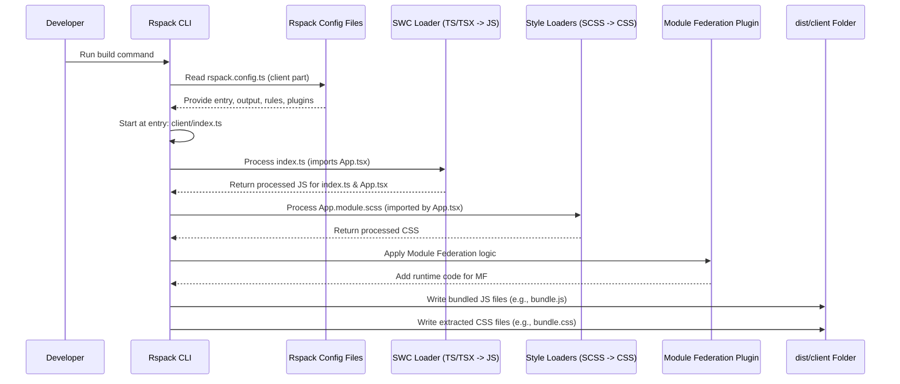

# Chapter 6: Rspack Build Configuration

In the [previous chapter](05_server_side_rendering__ssr__pipeline_.md), we saw how the server cleverly prepares our React application into HTML using the [Server-Side Rendering (SSR) Pipeline](05_server_side_rendering__ssr__pipeline_.md). But how does the server (and the browser) get the code in a format it can actually understand and run? Our source code is written in TypeScript (`.ts`, `.tsx`), uses fancy styling with SCSS (`.scss`), and includes modern React features. Browsers and the Node.js server environment mostly just understand plain JavaScript and CSS.

This is where our build tool, **Rspack**, comes into play!

## What's the Big Idea? The Code Factory Recipe

Imagine you're a chef (the developer) writing a complex recipe (your source code) using special ingredients and techniques (TypeScript, SCSS, React). Before this recipe can be served to customers (run in browsers or on the server), it needs to be prepared in a professional kitchen (the **build process**).

**Rspack** is like the head chef *and* the recipe book for the kitchen staff. It takes your advanced recipe (source code) and provides detailed instructions (**configuration**) on how to:

1.  **Translate:** Convert special ingredients like TypeScript and SCSS into standard JavaScript and CSS that everyone understands.
2.  **Combine & Package:** Bundle different parts of the recipe (multiple code files) together efficiently.
3.  **Optimize:** Make the final dish smaller and faster to serve (minify code, split it into logical chunks).

The **Rspack Build Configuration** is the set of instructions we give Rspack, telling it *exactly* how to process our source code and produce the final, ready-to-run JavaScript and CSS files (we call these **bundles**) for both the browser (client) and the server.

## What is Rspack Doing?

Rspack is a modern **web bundler**. Its main jobs are:

*   **Bundling:** Starting from entry points (your main files), it finds all the code your application depends on (by following `import` statements) and bundles it into fewer files, usually one or more JavaScript files and CSS files. This reduces the number of requests the browser needs to make.
*   **Compiling/Transforming:** Using tools called **loaders**, it transforms code from one format to another. For example:
    *   TypeScript (`.ts`, `.tsx`) -> JavaScript (`.js`)
    *   SCSS (`.scss`) -> CSS (`.css`)
    *   Modern JavaScript features -> Older JavaScript compatible with more browsers
*   **Optimizing:** Using **plugins** and internal processes, it can minify code (remove unnecessary spaces and shorten variable names), split code into smaller chunks (so the browser only loads what's needed initially), manage assets like images, and much more.

Think of it as an automated factory assembly line for your code.

## Key Concepts: The Rspack Recipe Ingredients

Our Rspack configuration files (`rspack.config.ts` and the files they import) contain several key pieces of information:

1.  **`entry`**: Where should Rspack start processing? This points to the main file(s) of your application.
    *   *Analogy:* The first step in your recipe.
    *   *Example:* `./client/index.ts` for the browser code, `./server/index.ts` for the server code.

2.  **`output`**: Where should Rspack put the finished, processed files (bundles)?
    *   *Analogy:* Where the finished dishes are placed for pickup.
    *   *Example:* A folder like `dist/client` or `dist/server`, with specific filenames like `[name].[contenthash].js` (the `[contenthash]` helps with browser caching).

3.  **`module.rules` (Loaders)**: How should Rspack handle different types of files it encounters? Each rule typically tests for a file type (e.g., `.tsx`) and specifies which loader(s) to use.
    *   *Analogy:* Specific kitchen tools needed for certain ingredients (e.g., use the oven for baking, the blender for smoothies).
    *   *Example:* Use `builtin:swc-loader` for TypeScript files, use `sass-loader` and `builtin:lightningcss-loader` for SCSS files.

4.  **`plugins`**: These add extra power and capabilities to the build process beyond just transforming files.
    *   *Analogy:* Special stations in the kitchen (e.g., a packaging station, a quality control checker).
    *   *Example:* `ModuleFederationPlugin` (essential for our microfrontends, see [Module Federation Setup](03_module_federation_setup_.md)), `CssExtractRspackPlugin` (to put CSS in separate files), `CopyRspackPlugin` (to copy static assets like images).

5.  **`target`**: Which environment are we building for? This affects how Rspack bundles the code.
    *   *Analogy:* Are we preparing food for a dine-in customer or for takeaway?
    *   *Example:* `'web'` for code running in browsers, `'async-node'` for code running on a Node.js server.

6.  **`mode`**: Are we building for development or production?
    *   *Analogy:* Making a quick test dish (`development`) vs. preparing hundreds of dishes efficiently for a banquet (`production`).
    *   *Example:* `'development'` (faster builds, better debugging) or `'production'` (slower builds, highly optimized/smaller output).

## How `cohbrgr` Uses Rspack Configuration

In our project, the configuration is split across several files for better organization, mostly within the `build/configs` directory inside each application (`apps/shell`, `apps/content`) and a shared base configuration in `packages/build`.

Let's look at simplified pieces from the Shell application:

**1. The Main Entry Point (`apps/shell/rspack.config.ts`)**

This file simply imports and exports the configurations for the client (browser) and server builds. Rspack can process multiple configurations at once.

```typescript
// apps/shell/rspack.config.ts
import clientConfig from './build/configs/rspack.client.config';
import serverConfig from './build/configs/rspack.server.config';

// Export an array containing both configurations
export default [clientConfig, serverConfig];
```
*Explanation:* This tells Rspack: "Please run two separate build processes, one using the `clientConfig` instructions and another using the `serverConfig` instructions."

**2. Shared Base Configuration (`packages/build/src/configs/rspack.base.config.ts`)**

This file contains common settings used by *both* client and server builds to avoid repetition.

```typescript
// packages/build/src/configs/rspack.base.config.ts (simplified)
import { type RspackOptions } from '@rspack/core';
// ... other imports (resolve, constants, getStyleLoader) ...

export const baseConfig: RspackOptions = {
  // Set mode based on environment variable
  mode: isProduction ? 'production' : 'development',
  // Where to find source files
  context: resolve(CWD, `./src`),
  // How to handle different file types
  module: {
    rules: [
      // For .ts and .tsx files, use swc-loader
      { test: regexSource, use: [ /* swc-loader config */ ] },
      // For .scss files, use style loaders
      { test: regexStyle, use: getStyleLoader(), type: 'css/auto' },
    ],
  },
  // Resolve extensions automatically, setup aliases
  resolve: { extensions: ['.tsx', '.ts', /*...*/], /*...*/ },
};
```
*Explanation:* This sets up the basic "recipe" rules: how to determine the build mode, where the source code lives (`context`), and the fundamental loaders needed for TypeScript (`swc-loader`) and SCSS (`getStyleLoader`).

**3. Client Configuration (`apps/shell/build/configs/rspack.client.config.ts`)**

This file builds upon the `baseConfig` and adds settings specific to the code that runs in the browser.

```typescript
// apps/shell/build/configs/rspack.client.config.ts (simplified)
import { /*...*/ } from '@rspack/core';
import { merge } from 'webpack-merge'; // Tool to combine configs
// ... other imports (baseConfig, MF plugin) ...

const config: RspackOptions = {
  // Starting point for browser code
  entry: { bundle: './client/index.ts' },
  // Target environment is the web browser
  target: 'web',
  // Where to put the finished browser bundles
  output: {
    path: resolve(CWD, './dist/client'),
    filename: isProduction ? `[name].[contenthash].js` : `[name].js`,
    publicPath: 'http://localhost:3000/', // URL prefix for assets
  },
  // Add client-specific plugins
  plugins: [
    // Extract CSS into separate files
    new CssExtractRspackPlugin({ /* options */ }),
    // Copy static assets (images, etc.)
    new CopyRspackPlugin({ /* options */ }),
    // Module Federation plugin (client side)
    getModuleFederationPlugins().client, // See Chapter 3!
    // ... other plugins (progress bar, service worker) ...
  ],
  // Optimization settings (only for production)
  optimization: { minimize: isProduction, splitChunks: { /*...*/ } },
};

// Merge baseConfig with this client-specific config
export default merge(baseConfig, config);
```
*Explanation:* This configures the build for the browser: specifies the client entry point, targets the `'web'`, defines the output location (`dist/client`) and naming convention, sets the `publicPath` (important for loading assets and microfrontends), and adds plugins like the one for [Module Federation Setup](03_module_federation_setup_.md) (client version), CSS extraction, and asset copying. It also enables optimizations like minification for production builds.

**4. Server Configuration (`apps/shell/build/configs/rspack.server.config.ts`)**

This builds upon `baseConfig` for the code that runs on the Node.js server for SSR.

```typescript
// apps/shell/build/configs/rspack.server.config.ts (simplified)
import { /*...*/ } from '@rspack/core';
import { merge } from 'webpack-merge';
// ... other imports (baseConfig, MF plugin) ...

const config: RspackOptions = {
  // Starting point for server code
  entry: { index: './server/index.ts' },
  // Target environment is Node.js
  target: 'async-node',
  // Where to put the finished server bundle
  output: {
    path: resolve(CWD, './dist/server'),
    filename: '[name].js',
    library: { type: 'commonjs2' }, // How the server code is exported
  },
  // Add server-specific plugins
  plugins: [
    // Module Federation plugin (server side)
    getModuleFederationPlugins().server, // See Chapter 3!
    // ... other plugins (progress bar) ...
  ],
  // Don't bundle Node.js built-ins or 'express'
  externalsPresets: { node: true },
  externals: ['express'],
};

// Merge baseConfig with this server-specific config
export default merge(baseConfig, config);
```
*Explanation:* This configures the build for the server: specifies the server entry point, targets `'async-node'`, defines the output (`dist/server`), sets the `library.type` so Node.js can require the output correctly, includes the server version of the [Module Federation Setup](03_module_federation_setup_.md) plugin, and uses `externals` to tell Rspack *not* to bundle code that will already be available in the Node.js environment (like built-in modules or the `express` library).

The [Content Application (Remote Microfrontend)](02_content_application__remote_microfrontend__.md) has a very similar set of configuration files, but with details changed for its specific needs (e.g., different `output.publicPath`, different `name` and `exposes` settings in its Module Federation configuration).

## Under the Hood: The Build Assembly Line

When you run the build command (e.g., `npm run build` or `pnpm build`, which usually calls `rspack`), here's a simplified view of what happens:

1.  **Read Config:** Rspack reads the `rspack.config.ts` file(s).
2.  **Start Building (Client):** It starts processing the client configuration (`clientConfig`).
3.  **Find Entry:** It looks for the `entry` file: `apps/shell/src/client/index.ts`.
4.  **Follow Imports:** It reads `index.ts` and sees it imports `App.tsx`.
5.  **Apply Loaders:** It finds `App.tsx`. The file extension `.tsx` matches the rule for `regexSource`. Rspack uses the configured `builtin:swc-loader` to transform the TypeScript/React code into plain JavaScript.
6.  **More Imports:** While processing `App.tsx`, it might find `import './App.module.scss'`.
7.  **Apply Loaders (CSS):** It finds `App.module.scss`. This matches `regexStyle`. Rspack uses the style loaders (`sass-loader`, `builtin:lightningcss-loader`) to process the SCSS into CSS. The `CssExtractRspackPlugin` ensures this CSS ends up in a separate `.css` file.
8.  **Apply Plugins:** Rspack runs configured plugins. The `ModuleFederationPlugin` sets up the code needed to load remotes (like `content`). `CopyRspackPlugin` copies assets.
9.  **Bundle & Output:** Rspack bundles all the processed JavaScript into chunks and writes them (along with the extracted CSS files) to the `output.path` (`dist/client`), using the specified `output.filename` pattern.
10. **Start Building (Server):** Rspack repeats a similar process for the server configuration (`serverConfig`), targeting Node.js and outputting to `dist/server`, making sure not to bundle `externals`.

Here’s a diagram illustrating the simplified client build flow:



This process transforms our developer-friendly source code into optimized bundles ready to be served by our [Express Server & Middleware (Shell)](04_express_server___middleware__shell__.md) and run by browsers or the Node.js environment for SSR.

## Conclusion

You've now learned about the crucial role of the **Rspack Build Configuration**. It's the recipe book that tells our "code factory" (Rspack) exactly how to translate, combine, and optimize our TypeScript, SCSS, and React source code into the final JavaScript and CSS bundles.

Key takeaways:

*   Rspack is a **bundler** that processes modern web code into browser/server-friendly formats.
*   Configuration involves setting **entry** points, **output** locations, **loaders** for file types, and **plugins** for extra features.
*   We have separate configurations for **client** (browser) and **server** (Node.js) builds.
*   This build step is essential to prepare our code for both the [Server-Side Rendering (SSR) Pipeline](05_server_side_rendering__ssr__pipeline_.md) and for running interactively in the user's browser.

In a larger project like `cohbrgr`, built as a monorepo (a single repository containing multiple packages/apps), it's common to have shared code or utilities used by different applications (like both the Shell and Content apps). In the next chapter, we'll look at how these shared pieces are managed.

Next Up: [Shared Packages (Monorepo Utilities)](07_shared_packages__monorepo_utilities__.md)

---

Generated by [AI Codebase Knowledge Builder](https://github.com/The-Pocket/Tutorial-Codebase-Knowledge)