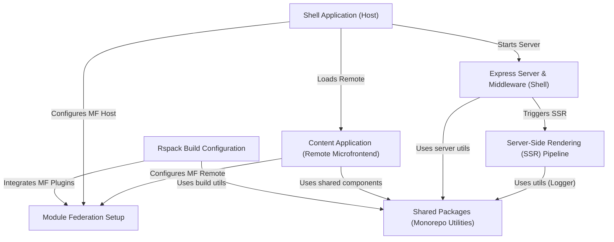

# Tutorial: cohbrgr

This project, `cohbrgr`, is a **web application** showcasing a *microfrontend architecture*.
It features a main `shell` application (the host) that dynamically loads a separate `content` application (a remote microfrontend) using **Module Federation**.
The project is built using the **Rspack** bundler and includes **Server-Side Rendering (SSR)** for improved performance and SEO.
*Utilities*, *components*, and *build configurations* are organized into **shared packages** within a monorepo, promoting code reuse between the `shell` and `content` applications.

**Source Repository:** [None](None)

## Chapters

1. [Shell Application (Host)
](01_shell_application__host__.md)
2. [Content Application (Remote Microfrontend)
](02_content_application__remote_microfrontend__.md)
3. [Module Federation Setup
](03_module_federation_setup_.md)
4. [Express Server & Middleware (Shell)
](04_express_server___middleware__shell__.md)
5. [Server-Side Rendering (SSR) Pipeline
](05_server_side_rendering__ssr__pipeline_.md)
6. [Rspack Build Configuration
](06_rspack_build_configuration_.md)
7. [Shared Packages (Monorepo Utilities)
](07_shared_packages__monorepo_utilities__.md)

---

Generated by [AI Codebase Knowledge Builder](https://github.com/The-Pocket/Tutorial-Codebase-Knowledge)