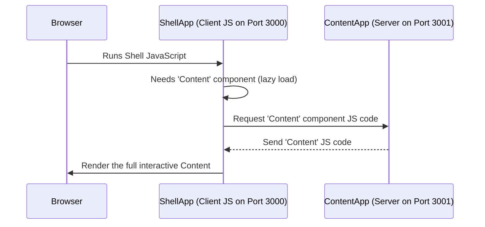

# Chapter 1: Microfrontend Architecture (Shell & Content)

Welcome to the `cohbrgr` project! This first chapter will introduce you to a core concept we use: **Microfrontend Architecture**. Don't worry if that sounds complicated – we'll break it down step-by-step.

## What Problem Does This Solve?

Imagine building a large website, like an online store. You might have different sections: product listings, a shopping cart, user profiles, and a blog. Traditionally, all these parts are bundled together into one big application.

What if different teams want to work on different sections? What if the shopping cart team wants to update their part without waiting for the blog team? With one big application (often called a "monolith"), this becomes difficult. Everyone has to coordinate releases, and a small bug in one part can potentially break the entire site.

Microfrontends offer a solution!

## What Are Microfrontends? Think Building Blocks!

Microfrontends are like LEGO bricks for web applications. Instead of one giant, inseparable structure, you build your website from smaller, independent pieces (the microfrontends) that fit together.

Each piece can be:
*   Developed by a separate team.
*   Deployed independently.
*   Potentially even use different technologies (though we keep it simpler in `cohbrgr`).

## The Shell & Content Model

In `cohbrgr`, we use a common microfrontend pattern called **Shell & Content**.

*   **The Shell:** Think of this as the picture frame. It provides the overall structure of the application – the header, the footer, the main navigation area. It holds everything together but doesn't necessarily know the *details* of what's inside the frame. In our project, the `shell` application acts as this frame.
*   **The Content:** This is the picture inside the frame. It provides the specific content for a particular page or view. When you navigate the site, the `shell` might stay the same, but the `content` part changes. In our project, the `content` application provides this main page information.


*(Imagine the outer box is the Shell, and the inner box is the Content)*

## How `cohbrgr` Uses Shell & Content

Our project is split into two main, separate applications:

1.  `shell`: This application runs (by default) on port 3000. It's responsible for:
    *   The overall HTML structure.
    *   Handling browser requests and routes.
    *   Displaying the main layout (like headers or navigation bars, though it's minimal here).
    *   Loading and displaying the content from the `content` app.

2.  `content`: This application runs (by default) on port 3001. It's responsible for:
    *   Providing the main chunk of UI you see on the homepage (like the "My name is Christian" text and links).
    *   It *exposes* this UI piece so the `shell` can use it.

These two applications run independently. You can see this defined in the `docker-compose.yml` file, which sets up separate containers for each:

```yaml
# docker-compose.yml
version: '3'
services:
    shell: # The 'Shell' application service
        build:
            context: .
            dockerfile: ./Dockerfile.shell # Uses shell's specific Dockerfile
        ports:
            - '3000:3000' # Makes shell accessible on port 3000
        depends_on:
            - content # Shell needs content to be available

    content: # The 'Content' application service
        build:
            context: .
            dockerfile: ./Dockerfile.content # Uses content's Dockerfile
        ports:
            - '3001:3001' # Makes content accessible on port 3001
```
*   This file tells Docker (a tool for running applications in containers) to build and run two services: `shell` and `content`, each using its own setup (`Dockerfile`) and running on different ports.

## How Do They Talk to Each Other?

If they run separately, how does the `shell` show the UI from the `content` app? They use a clever technique called **Module Federation**. We'll dive deep into this in the next chapter: [Module Federation (via Rspack)](02_module_federation__via_rspack__.md).

For now, just know that Module Federation allows one running application (`shell`) to dynamically load code (like a React component) from another running application (`content`) directly in the browser or on the server.

**In the `content` app:** We explicitly say, "Make the `Content` component available for others to use."

```typescript
// Simplified from apps/content/build/configs/rspack.federated.config.ts
// ... inside ModuleFederationPlugin configuration ...
  exposes: {
    // '.' means the root, './Content' is the name others will use
    './Content': 'src/client/components/content', // Path to the actual file
  },
// ...
```
*   This configuration tells the build tool that the component located at `src/client/components/content` should be "exposed" under the name `./Content`.

**In the `shell` app:** We say, "I need the component named `Content` from the `content` application."

```typescript
// apps/shell/src/client/App.tsx

// Import the 'Content' component FROM the 'content' microfrontend
const Content = lazy(
    () => import('content/Content') // Special import path for federated module
);

// ... later in the component ...
<Suspense fallback={<Spinner />}>
    {/* Use the loaded Content component here */}
    <Content />
</Suspense>
// ...
```
*   `import('content/Content')` looks like a normal import, but Module Federation intercepts it and knows `content` refers to the running `content` application.
*   `lazy` and `Suspense` are React features that allow us to load the `Content` component only when needed and show a loading indicator (`<Spinner />`) while it's being fetched from the `content` app.

## Under the Hood: A Simple Flow

Let's trace what happens when you visit the homepage:

1.  **Browser:** You type `http://localhost:3000` and hit Enter.
2.  **Shell Server:** Receives the request. It prepares the basic HTML page structure (the frame).
3.  **Shell Server:** Using Module Federation (server-side), it asks the `content` application (running on port 3001) for the HTML code for the `Content` component.
4.  **Content Server:** Renders its `Content` component to HTML and sends it back to the `shell` server.
5.  **Shell Server:** Inserts the received HTML into its page structure and sends the complete HTML page back to your browser. (This is part of [Server-Side Rendering (SSR) Pipeline (Shell)](04_server_side_rendering__ssr__pipeline__shell__.md))
6.  **Browser:** Displays the initial page. It then loads the JavaScript for the `shell` application.
7.  **Shell Client (JS):** The JavaScript runs. React takes over the page. It sees that the `Content` component is needed.
8.  **Shell Client (JS):** Using Module Federation (client-side), it requests the *JavaScript code* for the `Content` component from the `content` application's server.
9.  **Content Server:** Sends the JavaScript code for the `Content` component.
10. **Shell Client (JS):** Receives the code, executes it, and makes the page interactive.

Here's a simplified diagram of the client-side loading part:



## Why Bother? The Benefits

*   **Independent Teams:** Team A can work on the `shell`, Team B on the `content`. They don't block each other.
*   **Independent Deployments:** Team B can update and deploy the `content` app without needing to redeploy the `shell` (and vice-versa). This means faster updates and less risk.
*   **Resilience:** If the `content` app crashes *after* the initial load, the `shell` might still function (though the content area would be broken). In a monolith, the whole site might go down.

## Conclusion

You've learned the basic idea behind Microfrontend Architecture, specifically the **Shell & Content** pattern used in `cohbrgr`. We split our application into:

*   A `shell` app: Provides the main structure and hosts other parts.
*   A `content` app: Provides a specific piece of UI (the main page content).

They run independently but work together, allowing for separate development and deployment.

But how exactly does the `shell` load code from the `content` app across different ports? That's where the magic of Module Federation comes in. Let's explore that next!

**Next Up:** [Module Federation (via Rspack)](02_module_federation__via_rspack__.md)

---

Generated by [AI Codebase Knowledge Builder](https://github.com/The-Pocket/Tutorial-Codebase-Knowledge)