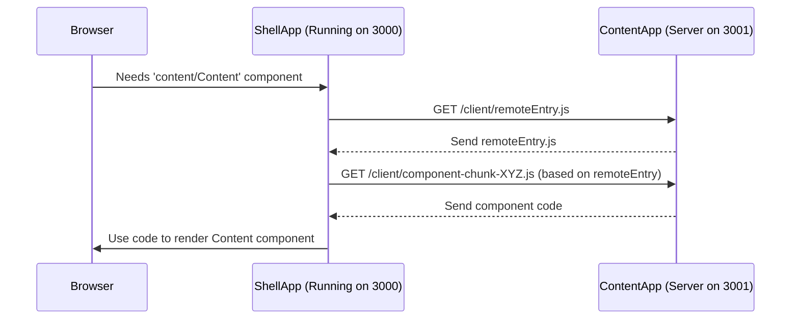

# Chapter 2: Module Federation (via Rspack)

In [Chapter 1: Microfrontend Architecture (Shell & Content)](01_microfrontend_architecture__shell___content__.md), we learned that `cohbrgr` is split into two separate applications: a `shell` (the frame) and `content` (the picture). They run independently, maybe even on different servers or ports (like `localhost:3000` and `localhost:3001`).

But this raises a question: If they are separate, how does the `shell` actually *show* the user interface that comes from the `content` app? How can they share code without being bundled together into one big application?

The answer is a powerful technique called **Module Federation**.

## What's the Problem Again? Sharing is Caring (and Hard)

Imagine you have two completely separate websites running:
1.  `MyWebsiteFrame.com` (our `shell`)
2.  `MyWebsiteContent.com` (our `content`)

The `shell` needs to display a fancy "Welcome Box" component that the `content` team built. How can it do that?

*   **Old way (copy-paste):** Copy the "Welcome Box" code into the `shell` project. *Problem:* Now you have two copies! If the `content` team updates the box, the `shell` team has to remember to copy the changes again. Error-prone!
*   **Old way (shared library):** Put the "Welcome Box" into a separate package (like an npm package) and have both `shell` and `content` install it. *Problem:* Better, but now you need to manage versions. If you update the shared package, you have to update *and redeploy* both `shell` and `content`, even if only one of them needed the change. This couples their release cycles.

We want something better: allow the `shell` to use the "Welcome Box" *directly* from the running `content` application, *at runtime*, without needing to copy code or tightly manage shared packages.

## Module Federation: Sharing LEGOs at Runtime

**Module Federation** is the technical magic that makes this possible. It's built into our build tool, **Rspack** (which is like a super-fast version of Webpack).

Think back to the LEGO analogy from Chapter 1:
*   The `shell` app is one LEGO structure.
*   The `content` app is another LEGO structure.

Module Federation allows the `content` app to say, "Hey, see this specific blue LEGO brick (our `Content` component)? I'm making it available for others to use!" This is called **exposing** a module.

Then, the `shell` app can say, "I need that specific blue LEGO brick from the `content` app to put right here in my structure!" This is called **consuming** a remote module.

Crucially, this happens *while the applications are running*. The `shell` doesn't need the `content` app's source code when it's being built; it just needs to know *where* to find the `content` app and *what name* the shared brick has.

## How `cohbrgr` Uses Module Federation

In `cohbrgr`, we configure Module Federation using Rspack:

1.  **The `content` app (the "Remote") EXPOSES its component:**
    We tell Rspack in the `content` app's configuration that we want to share the `Content` component.

    ```typescript
    // Simplified from apps/content/build/configs/rspack.federated.config.ts

    // Inside ModuleFederationPlugin settings for 'content' app:
    // ...
    exposes: {
      // The name 'shell' will use:   The actual file path:
      './Content':                  'src/client/components/content',
    },
    // ...
    ```
    *   This configuration says: "Make the code from the file `src/client/components/content` available to other apps under the name `./Content`."

2.  **The `shell` app (the "Host") knows where to find REMOTES:**
    We tell Rspack in the `shell` app's configuration where the `content` app lives and what name we give it (`content`).

    ```typescript
    // Simplified from apps/shell/build/configs/rspack.federated.config.ts

    // Inside ModuleFederationPlugin settings for 'shell' app:
    // ...
    remotes: {
      // Our internal name:  Where to find the remote's entry point:
      content:             `content@http://localhost:3001/client/remoteEntry.js`,
      //                     (URL might change based on environment)
    },
    // ...
    ```
    *   This configuration says: "There's a remote application I call `content`. You can find its list of exposed modules by loading the `remoteEntry.js` file from its URL (which is `http://localhost:3001/client/` in this local setup)."

3.  **The `shell` app CONSUMES the remote component:**
    Now, in the `shell` application's code, we can import the `Content` component almost like a regular import!

    ```typescript
    // apps/shell/src/client/App.tsx
    import { lazy, Suspense } from 'react';
    import { Spinner } from '@cohbrgr/components'; // A loading indicator

    // Magic import! 'content' is the remote name from config,
    // '/Content' is the exposed module name.
    const Content = lazy(() => import('content/Content'));

    // ... later in the component ...
    <Suspense fallback={<Spinner />}>
      {/* Use the dynamically loaded Content component */}
      <Content />
    </Suspense>
    ```
    *   `import('content/Content')`: This looks special! Rspack sees this and, because of the Module Federation setup, knows it shouldn't look for a local file named `content/Content`. Instead, it knows to fetch the code for the `./Content` module from the `content` remote application (at `http://localhost:3001`).
    *   `lazy` and `Suspense`: These are standard React features. `lazy` tells React to load this component only when it's first needed. `Suspense` lets us show a placeholder (like our `<Spinner />`) while the code is being loaded over the network from the `content` app.

## Under the Hood: A Quick Peek

How does `import('content/Content')` actually work at runtime?

1.  **Shell Needs Component:** Your browser loads the `shell` app. React tries to render the `App` component.
2.  **Lazy Load Triggered:** It hits the `lazy(() => import('content/Content'))` line.
3.  **Module Federation Runtime:** The special Module Federation JavaScript code (added by Rspack) kicks in. It checks its configuration: "Ah, `content` refers to the remote at `http://localhost:3001/.../remoteEntry.js`."
4.  **Fetch Remote Entry:** The browser fetches the `remoteEntry.js` file from the `content` app's server. This file acts like a directory, telling the shell *how* to get the actual code for `./Content`.
5.  **Fetch Component Code:** Following the instructions in `remoteEntry.js`, the browser makes another request to the `content` server to get the JavaScript chunk(s) containing the `Content` component code.
6.  **Execute and Render:** The browser receives the code, runs it, and React can now render the actual `Content` component that came from the `content` app.

Here's a simplified diagram of that fetch process:



This all happens automatically thanks to the `ModuleFederationPlugin` configured in our Rspack build files. We'll look closer at the specifics of these configuration files in [Chapter 6: Build System (Rspack Configuration)](06_build_system__rspack_configuration__.md).

**Important:** Module Federation in `cohbrgr` works both on the server (during [Server-Side Rendering (SSR) Pipeline (Shell)](04_server_side_rendering__ssr__pipeline__shell__.md)) and on the client (in the browser, as shown above). The mechanism is slightly different, but the core idea of sharing code dynamically remains the same.

## Why is This So Cool?

*   **True Independence:** The `content` team can update and deploy their `Content` component whenever they want, and the `shell` will automatically pick up the new version the next time it needs to load it (or on the next page refresh), without the `shell` needing a rebuild or redeploy.
*   **Shared Code, Not Bundled Code:** We share code without creating a monolithic bundle. Apps load faster initially because they only download the code they absolutely need to start.
*   **Resilience:** If the `content` app fails to load *its specific component*, the rest of the `shell` app can potentially still function.

## Conclusion

Module Federation (powered by Rspack in our case) is the key technology that enables our `shell` and `content` microfrontends to collaborate effectively. It allows the `content` app to **expose** specific modules (like its main `Content` component), and the `shell` app to **consume** them dynamically at runtime, fetching the necessary code directly from the running `content` application. This gives us the benefits of code sharing without the drawbacks of tight coupling or complex shared library management.

Now that we understand how the `shell` can load parts from `content`, let's take a closer look at the structure of the main application that acts as the host.

**Next Up:** [Client Application Structure (Shell)](03_client_application_structure__shell__.md)

---

Generated by [AI Codebase Knowledge Builder](https://github.com/The-Pocket/Tutorial-Codebase-Knowledge)