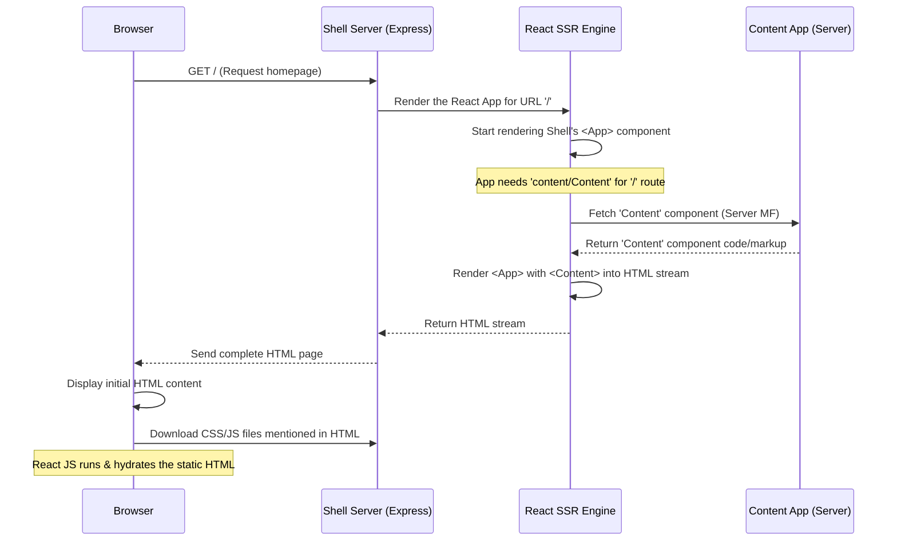

# Chapter 4: Server-Side Rendering (SSR) Pipeline (Shell)

In [Chapter 3: Client Application Structure (Shell)](03_client_application_structure__shell__.md), we saw how the React code running in the browser (`shell/src/client`) makes our website interactive and handles navigation without full page reloads. But how does the *very first* view of the website appear so quickly?

Imagine going to a restaurant. You could wait at your table while the staff brings out every ingredient one by one and assembles your meal right in front of you (like purely client-side rendering). Or, the kitchen could prepare the main plate, assemble it, and then bring the mostly complete dish to your table (like Server-Side Rendering). The second way usually means you see your food much faster!

This chapter explains how the `cohbrgr` **`shell`** application uses the "kitchen" approach – Server-Side Rendering (SSR) – to prepare the initial HTML of the page on the server before sending it to your browser.

## What Problem Does SSR Solve? Faster First Impressions!

If we only used the client-side code from Chapter 3, the process would look like this:
1.  Browser asks the server for the webpage.
2.  Server sends back a *nearly empty* HTML file, basically just saying "load this JavaScript file".
3.  Browser downloads the JavaScript.
4.  Browser runs the JavaScript (React starts).
5.  React figures out what HTML to create and *then* renders the page content.

The user sees a blank white screen during steps 2, 3, and 4, which can feel slow, especially on weaker devices or slow networks. Also, search engines (like Google) might have trouble understanding the content of the page if it's completely blank initially and only built by JavaScript later.

**Server-Side Rendering (SSR)** fixes this:
1.  Browser asks the server for the webpage.
2.  **Server runs the React application code itself**, generating the initial HTML structure for the requested page.
3.  Server sends back this *pre-filled* HTML file, which already contains the visible content.
4.  Browser immediately displays the HTML content it received. Looks fast!
5.  Browser downloads the JavaScript in the background.
6.  Browser runs the JavaScript (React starts).
7.  React "hydrates" the existing HTML – it attaches event listeners and makes the page interactive, without rebuilding the visible structure from scratch.

This makes the page *appear* complete much sooner (better perceived performance) and makes it easier for search engines to index the content.

## The SSR Pipeline in the `shell` Application

In `cohbrgr`, the server-side logic for the `shell` application handles SSR. This involves several pieces working together when a request comes in:

1.  **Node.js/Express Server:** Listens for incoming browser requests. (We'll dive deeper into this in [Chapter 5: Express Server & Middleware](05_express_server___middleware_.md)).
2.  **Rendering Middleware:** A specific piece of server code responsible for taking the React application components and turning them into an HTML string.
3.  **React's Server APIs:** We use functions provided by React specifically for rendering on the server (like `renderToPipeableStream`).
4.  **HTML Template:** A React component that defines the overall `<html>`, `<head>`, and `<body>` structure, including where to inject the rendered application and links to necessary CSS and JavaScript files.
5.  **Module Federation (Server-Side):** Just like on the client, if the page being rendered needs a component from the `content` app (as explained in [Chapter 2: Module Federation (via Rspack)](02_module_federation__via_rspack__.md)), the server needs to fetch and render that component *during* the SSR process. The setup allows this to happen seamlessly.

Let's trace the journey of a request:



## Under the Hood: Key Code Pieces

Let's look at simplified versions of the code involved in the `shell`'s server-side rendering process.

**1. The Server Entry Point (`apps/shell/src/server/index.ts`)**

This file sets up the Express server. It imports and uses our rendering middleware.

```typescript
// Simplified from apps/shell/src/server/index.ts
import express from 'express';
// ... other imports (compression, logging, etc.)

const app = express();
// ... apply other middleware (logging, security, static files) ...

// Import the function that creates our rendering middleware
// @ts-expect-error - Dynamic import handled by build
const renderThunk = (await import('./server-entry')).default;

// Create the actual rendering middleware function
const serverRender = renderThunk();

// Tell Express to use our rendering middleware for requests
app.use(serverRender);

// Start the server
app.listen(3000, () => {
  console.log('Server started on port 3000');
});
```

*   This code sets up a basic web server using Express.
*   It dynamically imports `./server-entry` which prepares the main rendering logic.
*   `app.use(serverRender)` tells Express that for incoming requests, it should pass them to our `serverRender` function to generate the response.

**2. The Rendering Middleware (`apps/shell/src/server/middleware/render.tsx`)**

This is where React's server rendering magic happens.

```typescript
// Simplified from apps/shell/src/server/middleware/render.tsx
import { Request, Response } from 'express';
import { renderToPipeableStream } from 'react-dom/server'; // React's SSR function
import { PassThrough } from 'stream';

// Our main HTML template component
import Index from 'src/server/template/Index.html';

const render = () => async (req: Request, res: Response) => {
    try {
        // Create a stream to send HTML piece by piece
        const { pipe } = renderToPipeableStream(
            // Render our main HTML template component
            <Index
                location={req.url} // Pass the requested URL
                nonce={res.locals['cspNonce']} // Security token
                // ... other props ...
            />,
            {
                // When the main shell is ready...
                onShellReady() {
                    res.statusCode = 200;
                    res.setHeader('Content-type', 'text/html');
                    // Start sending the HTML stream to the browser
                    pipe(res);
                },
                // Handle errors during rendering
                onError(error) {
                    console.error(error);
                    res.statusCode = 500;
                    res.send('<h2>Something went wrong</h2>');
                },
            }
        );
    } catch (error) {
        // Handle errors setting up the stream
        console.error(error);
        res.statusCode = 500;
        res.send('<h2>Server Error</h2>');
    }
};

export default render; // Export the middleware function
```

*   `renderToPipeableStream`: This function from `react-dom/server` takes our root React component (`<Index>`) and starts rendering it to an HTML stream. Streaming allows the browser to start receiving and displaying the HTML before the *entire* page is rendered on the server, improving performance.
*   `<Index ... />`: We render our main HTML template component, passing down information like the current URL (`req.url`) and a security `nonce`.
*   `onShellReady`: This callback runs when the initial HTML shell is ready. We set the status code and content type, then `pipe(res)` connects the rendering stream directly to the browser response, sending the HTML as it's generated.

**3. The HTML Template Component (`apps/shell/src/server/template/Index.html.tsx`)**

This React component defines the overall HTML structure sent to the browser.

```typescript
// Simplified from apps/shell/src/server/template/Index.html.tsx
import { FunctionComponent } from 'react';
// Use StaticRouter on the server!
import { StaticRouter } from 'react-router-dom/server';

import App from 'src/client/App'; // Our main client app component
import { AppStateProvider } from 'src/client/contexts/app-state';
// Components to include links to JS and CSS
import Javascript from 'src/server/template/components/Javascript.html';
import Stylesheets from 'src/server/template/components/Stylesheets.html';

interface IIndexProps { location: string; nonce: string; /* ... */ }

const Index: FunctionComponent<IIndexProps> = (props) => {
  return (
    <html lang="en">
      <head>
        <meta charSet="UTF-8" />
        <title>Christian Oberhamberger</title>
        {/* Component to add <link rel="stylesheet" ...> tags */}
        <Stylesheets nonce={props.nonce} isProduction={/*...*/} />
      </head>
      <body>
        {/* The main container where React will hydrate */}
        <div id="root">
          {/* Wrap App in providers and StaticRouter */}
          <AppStateProvider context={{ nonce: props.nonce }}>
            {/* StaticRouter needs the requested URL */}
            <StaticRouter location={props.location}>
              <App /> {/* Our main application from Chapter 3 */}
            </StaticRouter>
          </AppStateProvider>
        </div>

        {/* Component to add <script src="..."> tags */}
        <Javascript nonce={props.nonce} isProduction={/*...*/} />
      </body>
    </html>
  );
};

export default Index;
```

*   **`StaticRouter`**: Notice we use `<StaticRouter>` here, not `<BrowserRouter>` (which we used in the client code). `StaticRouter` is designed for server environments where the URL doesn't change dynamically like in a browser. We provide it the `location` (the requested URL) so it can render the correct initial route within our `<App>` component.
*   **`<div id="root">`**: This is crucial. The server renders the output of `<App />` inside this div. Later, on the client-side, `hydrateRoot(document.getElementById('root'), ...)` (from [Chapter 3](03_client_application_structure__shell__.md)) will find this div and attach the interactive React logic to the server-rendered HTML inside it.
*   **`<Stylesheets />` & `<Javascript />`**: These are helper components that figure out which CSS and JS files need to be included in the final HTML (based on the build output) and render the appropriate `<link>` and `<script>` tags. The `<Javascript />` component also embeds the initial state (`window.__initial_state__`) needed for client-side hydration.

**4. Embedding Initial State (`apps/shell/src/server/template/components/Javascript.html.tsx`)**

The client needs some initial data (like the `nonce`) that the server used. We embed this directly into the HTML.

```typescript
// Simplified from apps/shell/src/server/template/components/Javascript.html.tsx
import { FunctionComponent } from 'react';
import { State } from 'src/client/store/state'; // Type for shared state

interface IJavascriptHTMLProps { nonce: string; /* ... */ }

const Javascript: FunctionComponent<IJavascriptHTMLProps> = (props) => {
  // Prepare the initial state object
  const __initial_state__: State = { nonce: props.nonce };

  return (
    <>
      {/* Embed state as a global JS variable */}
      <script
        id="initial-state"
        nonce={props.nonce} // Use nonce for security
        dangerouslySetInnerHTML={{
          __html: `window.__initial_state__ = ${JSON.stringify(__initial_state__)}`,
        }}
      ></script>

      {/* Add script tags for the main application bundles */}
      {/* <script async type="module" src="/main.js" nonce={props.nonce}></script> */}
      {/* ... dynamically add other needed JS files ... */}
    </>
  );
};

export default Javascript;
```

*   This component creates a `<script>` tag.
*   Inside the tag, it defines a global JavaScript variable `window.__initial_state__`.
*   It converts the `__initial_state__` object into a JSON string and assigns it to this variable.
*   The client-side code (`bootstrap.tsx`) reads `window.__initial_state__` to get this data when it starts up.

## Conclusion

Server-Side Rendering (SSR) is like having the kitchen prepare your meal before bringing it to the table. In `cohbrgr`, the `shell` application's server uses Node.js, Express, and React's server APIs (`renderToPipeableStream`) to:

1.  Receive a browser request.
2.  Render the necessary React components (including potentially fetching remote ones via server-side Module Federation) into an HTML string within a template (`Index.html.tsx`).
3.  Use `<StaticRouter>` to handle routing correctly on the server.
4.  Inject initial state needed by the client into a `<script>` tag.
5.  Send the complete, pre-rendered HTML back to the browser.

This results in a faster perceived initial load time and better SEO compared to sending an empty HTML shell. The client-side JavaScript then takes over this HTML ("hydrates" it) to make the page interactive.

Now that we understand *what* the server renders, let's look more closely at the server framework itself and how it handles requests and middleware.

**Next Up:** [Chapter 5: Express Server & Middleware](05_express_server___middleware_.md)

---

Generated by [AI Codebase Knowledge Builder](https://github.com/The-Pocket/Tutorial-Codebase-Knowledge)