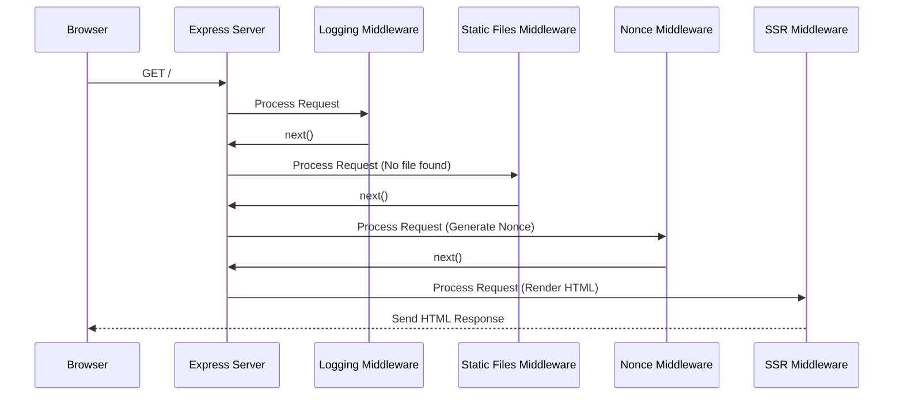

# Chapter 5: Express Server & Middleware

In [Chapter 4: Server-Side Rendering (SSR) Pipeline (Shell)](04_server_side_rendering__ssr__pipeline__shell__.md), we learned how the `shell` application's server generates the initial HTML for a page *before* sending it to the browser. This makes the site feel faster and helps search engines.

But how does the server actually *know* what to do when a browser request comes in? How does it handle different tasks like logging visits, checking security, or serving files like images and CSS? This is where **Express.js** and the concept of **Middleware** come into play.

## What Problem Does This Solve? The Server's Front Desk

Imagine our web server is like a large office building. When someone (a browser request) arrives at the entrance, they don't just wander straight into any office (the Server-Side Rendering logic). They need to go through a process:

1.  **Reception:** Someone needs to greet the visitor (receive the request).
2.  **Security Check:** Maybe check their ID or purpose (apply security rules like rate limiting).
3.  **Information Desk:** Perhaps give them a map or directions (serve static files like CSS or JavaScript if requested).
4.  **Routing:** Finally, direct them to the correct office or floor (pass the request to the right handler, like our SSR engine).

Without a system, this would be chaos! **Express.js** is like the framework or blueprint for setting up this reception area and its processes. **Middleware** functions are like the individual staff members (receptionist, security guard, information desk attendant) who perform specific tasks on each incoming visitor (request) before they reach their final destination.

In `cohbrgr`, the `shell` application uses an Express server as its backend foundation. Middleware functions handle all the necessary "front desk" tasks before the request is handed off to generate the page using Server-Side Rendering.

## Key Concepts: Express and Middleware

Let's break down these two core ideas:

1.  **Express.js (The Framework):**
    *   Express is a popular, minimal, and flexible web application framework for Node.js (the JavaScript environment our server runs in).
    *   It provides a simple way to:
        *   Start a web server that listens for requests on a specific port (like port 3000).
        *   Handle different types of web requests (like GET requests for fetching pages).
        *   Manage the "request-response cycle" – receiving a request, processing it, and sending back a response.
        *   Organize server logic using routing and middleware.
    *   Think of it as providing the basic structure and tools for building the reception area.

2.  **Middleware (The Checkpoints):**
    *   Middleware functions are the heart of how Express processes requests.
    *   They are functions that have access to the incoming request (`req`), the outgoing response (`res`), and a special function called `next`.
    *   Each middleware function performs a specific task: logging, checking headers, compressing data, serving a file, etc.
    *   Crucially, after a middleware function finishes its task, it usually calls `next()` to pass control to the *next* middleware function in the chain. If it doesn't call `next()`, the request processing stops (e.g., if it sends a response directly, like an error message).
    *   Think of middleware as a pipeline or an assembly line. Each request goes through various stations (middleware functions) for processing.


*(Each MW box performs a task and passes the request along)*

## How `cohbrgr` Uses Express & Middleware

Let's look at the `shell` server's main setup file to see how Express and middleware are used.

**1. Setting up the Express App:**

We start by importing Express and creating an application instance.

```typescript
// Simplified from apps/shell/src/server/index.ts
import express from 'express';
// ... other imports ...

const app = express(); // Create the Express application

// ... middleware setup happens here ...

// Start the server listening on a port
app.listen(3000, () => {
  console.log('Server listening on port 3000');
});
```
*   `express()` creates our main application object, usually called `app`.
*   `app.listen()` starts the server, making it ready to accept incoming requests on the specified port (3000 in this case).

**2. Adding Middleware with `app.use()`:**

The `app.use()` method is how we tell Express to add a middleware function to the processing pipeline. The order in which we use `app.use()` matters, as requests flow through them sequentially.

Here are some examples from `cohbrgr`:

```typescript
// Simplified from apps/shell/src/server/index.ts
import compression from 'compression';
import nocache from 'nocache';
import { logging, methodDetermination } from '@cohbrgr/server';
// ...

// Disable browser caching
app.use(nocache());

// Log incoming requests (custom middleware)
app.use(logging(isProduction));

// Check if the request method is allowed (GET/HEAD)
app.use(methodDetermination);

// Compress responses for faster delivery
app.use(compression());

// Serve static files (CSS, JS, images) from the 'dist/client' folder
app.use(express.static(staticPath));

// Generate a security token (nonce) for this request
app.use((_req, res, next) => {
    res.locals['cspNonce'] = generateNonce(); // Simplified
    next(); // Pass control to the next middleware
});

// Finally, use the SSR middleware (from Chapter 4)
app.use(serverRender);
```

*   **`nocache()`**: Prevents the browser from caching responses.
*   **`logging(...)`**: Our custom middleware (from `packages/server`) to log details about the request. We pass `isProduction` to potentially change logging behavior.
*   **`methodDetermination`**: Another custom middleware that checks if the request uses an allowed HTTP method (like GET). If not, it sends an error response and stops processing.
*   **`compression()`**: Compresses response bodies (like HTML, CSS, JS) using gzip, making them smaller and faster to download.
*   **`express.static(staticPath)`**: If the request asks for a file (e.g., `/main.css`), this middleware checks if a file with that name exists in the `staticPath` directory (`dist/client`). If found, it sends the file back directly and stops further processing for that request.
*   **Nonce Generation**: A simple inline middleware function. It generates a random security token (`nonce`), attaches it to the response object (`res.locals`), and then calls `next()` to continue processing. This nonce is used later in the [SSR Pipeline](04_server_side_rendering__ssr__pipeline__shell__.md) for Content Security Policy.
*   **`serverRender`**: This is the SSR middleware we discussed in [Chapter 4](04_server_side_rendering__ssr__pipeline__shell__.md). It's typically placed last or near the end because it handles generating the main HTML page response *if* the request hasn't already been handled by earlier middleware (like `express.static`).

**3. A Peek at a Simple Middleware Function:**

Let's look at the `logging` middleware.

```typescript
// Simplified from packages/server/src/middleware/logging.ts
import { Logger } from '@cohbrgr/utils';
import { NextFunction, Request, Response } from 'express';

export const logging =
    (isProduction: boolean) => // Outer function receives config
    (req: Request, _res: Response, next: NextFunction) => { // The actual middleware
        const message = `Requesting: ${req.url}`;
        Logger.info(message); // Log the request URL

        next(); // IMPORTANT: Pass control to the next middleware!
    };
```
*   It takes the request (`req`), response (`res`), and `next` function as arguments.
*   It performs its task: logging the requested URL using our `Logger` utility.
*   It calls `next()` to signal that Express should move on to the next middleware in the chain.

## Internal Implementation: The Request Flow

Let's trace a typical request for the homepage (`/`) step-by-step through the middleware pipeline:

1.  **Request Arrives:** Your browser sends a `GET /` request to `http://localhost:3000`.
2.  **Express Receives:** The Express server running receives the request.
3.  **`nocache()`:** This middleware adds headers to the response to prevent caching. Calls `next()`.
4.  **`logging()`:** Logs "Requesting: /" to the console. Calls `next()`.
5.  **`methodDetermination()`:** Checks the method (`GET`). It's allowed. Calls `next()`.
6.  **`compression()`:** Sets up response compression. Calls `next()`.
7.  **`express.static()`:** Looks for a file named `/` in the static directory. Doesn't find one (it's not a direct file request). Calls `next()`.
8.  **Nonce Generation:** Creates a random nonce (e.g., `abc123xyz`) and stores it in `res.locals.cspNonce`. Calls `next()`.
9.  **`serverRender()`:** This is the SSR middleware. It takes over, uses the nonce, renders the React app for the `/` route (potentially fetching content from the `content` app via server-side [Module Federation](02_module_federation__via_rspack__.md)), and sends the final HTML response back to the browser. Since this middleware sends the response, it *doesn't* call `next()`.
10. **Done:** The request-response cycle is complete.

Here's a simplified diagram of this flow:



If the request was for `/main.css`:
- The `express.static()` middleware *would* find the file.
- It would send the `main.css` content back to the browser.
- It would *not* call `next()`. The request processing would stop there, and the `serverRender` middleware would never run for that request.

## Conclusion

You've learned how the `cohbrgr` backend uses **Express.js** as its foundation and **Middleware** functions as checkpoints in a pipeline to process incoming requests.

Key takeaways:
*   **Express** provides the structure for our Node.js web server.
*   **Middleware** functions handle specific tasks like logging, security, compression, and serving static files.
*   `app.use()` adds middleware to the processing chain in a specific order.
*   Middleware functions use `req` (request), `res` (response), and `next()` to perform tasks and pass control along the chain.
*   This organized approach allows us to build complex server logic by composing smaller, reusable pieces of middleware, eventually leading to handlers like our [Server-Side Rendering (SSR) Pipeline (Shell)](04_server_side_rendering__ssr__pipeline__shell__.md).

But how does all this code (both client and server) get bundled, optimized, and prepared for deployment? That's the job of our build system, powered by Rspack.

**Next Up:** [Build System (Rspack Configuration)](06_build_system__rspack_configuration__.md)

---

Generated by [AI Codebase Knowledge Builder](https://github.com/The-Pocket/Tutorial-Codebase-Knowledge)