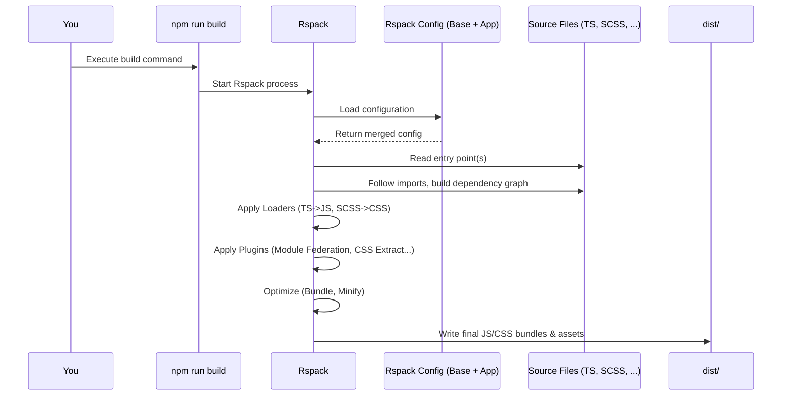

# Chapter 6: Build System (Rspack Configuration)

Welcome back! In [Chapter 5: Express Server & Middleware](05_express_server___middleware_.md), we saw how our `shell` application's server uses Express and middleware to handle incoming requests like a well-organized front desk. Now, let's zoom out a bit and look at how all the code we write (both for the server and the browser) gets transformed into something that can actually *run*.

## What Problem Does This Solve? From Recipe to Ready Meal!

Think about the code we write:
*   We use **TypeScript** (`.ts`, `.tsx` files) for better code safety and features, but browsers and Node.js understand **JavaScript** (`.js`).
*   We write modern **React** code with JSX syntax (`<div />`), which needs to be converted to regular JavaScript function calls.
*   We use **SCSS** (`.scss` files) for advanced styling, but browsers only understand **CSS** (`.css`).
*   We split our code into many small files for organization, but loading lots of small files in the browser is slow. It's better to combine them into fewer, larger files (**bundling**).
*   We want our final code to be small and fast, so we need to remove unnecessary comments, spaces, and shorten variable names (**minification**).

Doing all this manually would be tedious and error-prone! We need an automated process – a **Build System**.

Imagine you have a complex recipe (our source code). The build system is like a professional kitchen with automated machines:
*   It takes the raw ingredients (TypeScript, SCSS, React code).
*   It processes them (compiles TS to JS, converts SCSS to CSS).
*   It combines and optimizes them (bundles multiple files, minifies the code).
*   It produces the final, ready-to-serve meal (optimized JS and CSS bundles) that browsers and Node.js can understand and run efficiently.

In `cohbrgr`, our "kitchen machinery" is called **Rspack**.

## Key Concepts: Rspack and Configuration

1.  **Build System:** The overall process and tools used to transform source code into runnable code.
2.  **Rspack:** The specific tool we use. It's a *very fast* build tool written in Rust (another programming language known for speed). It's designed to be compatible with another popular build tool called Webpack, meaning it understands similar concepts and configurations.
3.  **Bundling:** Combining multiple source code files into fewer output files (bundles).
4.  **Transpiling/Compiling:** Converting code from one language or version to another (e.g., TypeScript to JavaScript, SCSS to CSS).
5.  **Optimization:** Making the output code smaller and faster (e.g., minification, code splitting).
6.  **Configuration Files (`rspack.config.ts`):** These are special files where we tell Rspack *how* to build our project. We define:
    *   Where to start processing (the **entry point**).
    *   How to handle different file types (**loaders**).
    *   What extra tasks to perform (**plugins**, like setting up [Module Federation (via Rspack)](02_module_federation__via_rspack__.md)).
    *   Where to put the final output files (**output**).

## Shared vs. App-Specific Configuration

Since both our `shell` and `content` applications need similar build steps (they both use React, TypeScript, SCSS), we share common configuration logic to avoid repetition.

*   **`packages/build`:** This shared package contains the *base* Rspack configuration (`rspack.base.config.ts`) and common helper functions or loaders used by both applications. Think of this as the standard operating procedures for the factory.
*   **`apps/shell/build`:** Contains configuration files *specific* to the `shell` application (like its entry points, output paths, and Module Federation settings for *consuming* remotes). This is like the specific setup for the `shell` assembly line.
*   **`apps/content/build`:** Contains configuration files *specific* to the `content` application (entry points, output paths, and Module Federation settings for *exposing* modules). This is the setup for the `content` assembly line.

This structure keeps things organized (Don't Repeat Yourself - DRY).

## Using the Build System

You typically don't run Rspack directly. Instead, you use scripts defined in the `package.json` files (usually triggered via `npm run build` or `npm start`). These scripts call Rspack with the correct configuration files.

Rspack then reads its configuration and starts the build process.

## Internal Implementation: Rspack's Workflow

When you trigger a build (e.g., for the `shell` app's client code):

1.  **Read Config:** Rspack loads `apps/shell/rspack.config.ts`, which points to `apps/shell/build/configs/rspack.client.config.ts` and `rspack.server.config.ts`. Let's focus on the client.
2.  **Merge Config:** The client config (`rspack.client.config.ts`) *merges* its specific settings with the shared `baseConfig` from `packages/build`.
3.  **Find Entry Point:** It looks for the starting file specified in the config (e.g., `entry: { bundle: './client/index.ts' }`).
4.  **Build Dependency Graph:** Starting from the entry point, Rspack follows all `import` statements to find every single piece of code (TS, SCSS, images, etc.) that the application depends on.
5.  **Apply Loaders:** For each file type it encounters, Rspack uses the configured **loaders** (defined in `module.rules`) to transform the code.
    *   A `.ts` or `.tsx` file goes through a TypeScript loader (like `builtin:swc-loader`) to become JavaScript.
    *   An `.scss` file goes through SCSS and CSS loaders (like `sass-loader` and `builtin:lightningcss-loader`) to become CSS.
6.  **Apply Plugins:** Rspack runs configured **plugins** which can perform a wide range of tasks:
    *   `ModuleFederationPlugin`: Sets up the Module Federation configuration (defining remotes or exposes).
    *   `CssExtractRspackPlugin`: Pulls all the processed CSS out into separate `.css` files.
    *   `CopyRspackPlugin`: Copies static assets (like images) to the output directory.
    *   `InjectManifest`: Helps build the service worker file.
7.  **Optimize:** It performs optimizations like bundling code into chunks (`splitChunks`), minimizing JS and CSS (`minimize: true` in production), etc.
8.  **Write Output:** Finally, Rspack writes the resulting bundles (e.g., `bundle.js`, `main.css`) and assets to the specified output directory (e.g., `dist/client`).

Here's a simplified diagram of the process:



## Diving Into the Configuration Code

Let's look at some simplified snippets from the configuration files.

**1. Shared Base Config (`packages/build/src/configs/rspack.base.config.ts`)**

This file defines settings common to all builds.

```typescript
// Simplified from packages/build/src/configs/rspack.base.config.ts
import { type RspackOptions } from '@rspack/core';
import { resolve } from 'path';
import { getStyleLoader } from '../loader/style.loader';
import { CWD, isProduction, Mode, /* ... */ } from '../utils/constants';

export const baseConfig: RspackOptions = {
    mode: isProduction ? Mode.PRODUCTION : Mode.DEVELOPMENT, // Build mode
    devtool: isProduction ? false : 'source-map', // Enable source maps for debugging
    context: resolve(CWD, `./src`), // Base directory for entry points
    resolve: {
        extensions: ['.tsx', '.ts', '.js', '.json', '.scss'], // File types Rspack recognizes
        alias: { src: resolve(CWD, './src') }, // Shortcut for imports
    },
    module: {
        rules: [ // How to handle different file types
            { // Rule for TypeScript/JavaScript files
                test: /\.(ts|tsx|js|jsx)$/, // Matches these file extensions
                exclude: [/node_modules/], // Don't process node_modules
                use: [{ loader: 'builtin:swc-loader', /* options */ }], // Use SWC loader
            },
            { // Rule for SCSS files
                test: /\.(s?[ac]ss)$/, // Matches .scss, .sass, .css
                use: getStyleLoader(), // Use our custom style loader setup
                type: 'css/auto', // Handle CSS Modules automatically
            },
        ],
    },
    experiments: { css: true }, // Enable built-in CSS handling
    // ... other base settings
};
```

*   `mode`: Sets whether we're building for development or production (affects optimizations).
*   `context`: The root folder for our source code.
*   `resolve`: Helps Rspack find imported files (e.g., lets us import `.ts` files without the extension).
*   `module.rules`: Defines how different file types are processed using **loaders**. We have rules for TypeScript/JavaScript files (using the fast `swc-loader`) and style files (using `sass-loader` and `lightningcss-loader` via `getStyleLoader`).
*   `experiments: { css: true }`: Enables Rspack's modern, built-in CSS handling capabilities.

**2. Shared Style Loader Setup (`packages/build/src/loader/style.loader.ts`)**

This defines the sequence of loaders for our styles.

```typescript
// Simplified from packages/build/src/loader/style.loader.ts
import { type RuleSetUseItem } from '@rspack/core';

export const getStyleLoader = (): RuleSetUseItem[] => {
    return [
        { // First, process with Lightning CSS (handles CSS Modules, optimizations)
            loader: 'builtin:lightningcss-loader',
            options: { modules: { /* config */ } },
        },
        { // Then, process SCSS files with Sass
            loader: 'sass-loader',
            options: { /* config */ },
        },
    ];
};
```

*   Loaders often work in reverse order: `sass-loader` converts SCSS to CSS, then `builtin:lightningcss-loader` processes that CSS (handling CSS Modules, vendor prefixes, and potentially minification).

**3. Shell Client Config (`apps/shell/build/configs/rspack.client.config.ts`)**

This configures the build specifically for the `shell` app's *browser* code.

```typescript
// Simplified from apps/shell/build/configs/rspack.client.config.ts
import { baseConfig, CWD, isProduction, /* ... */ } from '@cohbrgr/build';
import { defineConfig } from '@rspack/cli';
import { /* Plugins..., */ type RspackOptions } from '@rspack/core';
import { resolve } from 'path';
import { merge } from 'webpack-merge'; // Function to combine configs
import getModuleFederationPlugins from './rspack.federated.config';

const config: RspackOptions = {
    entry: { bundle: './client/index.ts' }, // Start bundling from this file
    target: 'web', // Build for the browser environment
    plugins: [
        // ... other plugins like ProgressPlugin, CopyRspackPlugin
        new CssExtractRspackPlugin({ /* config */ }), // Extract CSS to files
        getModuleFederationPlugins().client, // Add Module Federation Plugin!
        // ... Service Worker plugin for production
    ],
    optimization: { // How to optimize the output
        minimize: isProduction, // Minimize code only in production
        splitChunks: { chunks: 'all' }, // Split code into shared chunks
    },
    output: { // Where to put the results
        path: resolve(CWD, './dist/client'), // Output directory
        publicPath: 'http://localhost:3000/', // URL path for assets
        filename: isProduction ? `[name].[contenthash].js` : `[name].js`, // Output JS filenames
    },
};

// Merge the base config with this specific client config
export default defineConfig(merge(baseConfig, config));
```

*   `target: 'web'`: Tells Rspack this code runs in a browser.
*   `entry`: Specifies the main client entry file (`client/index.ts`).
*   `plugins`: Includes plugins like `CssExtractRspackPlugin` (to create separate CSS files) and crucially, the `ModuleFederationPlugin` (configured in `rspack.federated.config.ts`) which sets up the `shell` to consume remotes like `content`.
*   `optimization`: Configures how code is split and minimized.
*   `output`: Defines the output directory (`dist/client`), filenames (using `[contenthash]` for caching in production), and the `publicPath` (base URL for loading assets).
*   `merge(baseConfig, config)`: Combines the shared settings from `baseConfig` with these client-specific ones.

**4. Shell Server Config (`apps/shell/build/configs/rspack.server.config.ts`)**

This configures the build for the `shell` app's *Node.js server* code.

```typescript
// Simplified from apps/shell/build/configs/rspack.server.config.ts
import { baseConfig, CWD } from '@cohbrgr/build';
import { defineConfig } from '@rspack/cli';
import { /* Plugins..., */ type RspackOptions } from '@rspack/core';
import { resolve } from 'path';
import { merge } from 'webpack-merge';
import getModuleFederationPlugins from './rspack.federated.config';

const config: RspackOptions = {
    entry: { index: './server/index.ts' }, // Start from server entry point
    target: 'async-node', // Build for Node.js environment
    plugins: [
        // ... other plugins like ProgressPlugin
        getModuleFederationPlugins().server, // Module Federation for Server!
    ],
    output: {
        path: resolve(CWD, './dist/server'), // Output to dist/server
        filename: '[name].js', // Simple filename for server
        library: { type: 'commonjs2' }, // Output format for Node.js
    },
    externalsPresets: { node: true }, // Handle Node.js built-ins
    externals: ['express'], // Don't bundle 'express' (assume it's installed)
};

export default defineConfig(merge(baseConfig, config));
```

*   `target: 'async-node'`: Tells Rspack this code runs in Node.js.
*   `entry`: Specifies the server entry file (`server/index.ts`).
*   `plugins`: Also includes the `ModuleFederationPlugin`, but configured for server-side rendering needs.
*   `output`: Specifies the server output directory (`dist/server`) and the correct `library.type` for Node.js.
*   `externals: ['express']`: Tells Rspack *not* to include the `express` library code in the bundle. The server assumes `express` will be installed separately in `node_modules`. This keeps the server bundle smaller.

**5. Content App Config (`apps/content/build/configs/rspack.federated.config.ts`)**

The `content` app has similar client/server config files. The key difference is in its Module Federation setup, where it *exposes* modules instead of consuming them.

```typescript
// Simplified snippet from apps/content/build/configs/rspack.federated.config.ts
// Inside the ModuleFederationPlugin configuration for the 'content' app:
// ...
name: 'content', // Unique name for this remote app
filename: 'remoteEntry.js', // Standard entry point file name
exposes: { // Modules this app shares
    // Name used by consumers:    Path to the actual module:
    './Content':                './client/components/content',
},
shared: { /* Configuration for shared libraries like React */ },
// ...
```

*   `name: 'content'`: Identifies this application as `content` to other federated apps.
*   `exposes`: Lists the modules (`./Content`) that the `content` app makes available for others (like the `shell`) to import. This is the counterpart to the `remotes` section in the `shell`'s configuration.

## Conclusion

The Build System, powered by **Rspack**, is the automated factory that takes our developer-friendly source code (TypeScript, React, SCSS) and transforms it into optimized, production-ready JavaScript and CSS bundles that can run in browsers or on a Node.js server.

Key takeaways:
*   It handles compiling, bundling, and optimizing our code.
*   **Rspack** is a fast, modern build tool used in `cohbrgr`.
*   Configuration is done via `rspack.config.ts` files.
*   We use a **shared config** (`packages/build`) for common settings and **app-specific configs** (`apps/shell/build`, `apps/content/build`) for unique application needs (like entry points, output paths, and Module Federation roles).
*   The build process involves reading configs, finding dependencies, applying loaders and plugins, optimizing, and writing output files.
*   The Rspack configuration is where [Module Federation (via Rspack)](02_module_federation__via_rspack__.md) is set up using the `ModuleFederationPlugin`.

This build system relies heavily on shared code, both for the build configuration itself (`packages/build`) and for reusable components or utilities used across the applications. How is this sharing managed effectively? That's where the concept of a Monorepo comes in.

**Next Up:** [Shared Packages (Monorepo)](07_shared_packages__monorepo__.md)

---

Generated by [AI Codebase Knowledge Builder](https://github.com/The-Pocket/Tutorial-Codebase-Knowledge)