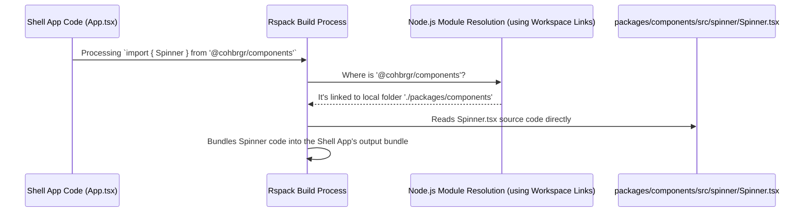

# Chapter 7: Shared Packages (Monorepo)

In [Chapter 6: Build System (Rspack Configuration)](06_build_system__rspack_configuration__.md), we saw how Rspack uses configuration files to build our `shell` and `content` applications. You might have noticed that we used a shared configuration from a `packages/build` directory. This hints at a core organizational principle in `cohbrgr`: using a **Monorepo** to manage **Shared Packages**.

## What Problem Does This Solve? The Shared Toolbox

Imagine you're building two different LEGO models (our `shell` and `content` apps). Both models need some basic, identical blue bricks (like a `<Spinner />` component for loading states) and some special tools to put them together (like common utility functions or build settings).

What are your options?
1.  **Make two separate piles of blue bricks:** You get identical blue bricks for each model kit. If the design of the blue brick changes, you have to update *both* piles. (This is like copy-pasting code between `apps/shell` and `apps/content` – inefficient and error-prone).
2.  **Order blue bricks separately:** You could order the blue bricks from a central LEGO factory every time you build either model. (This is like creating a separate `npm` package for *every* shared piece. It works, but can be cumbersome for small, frequently changing internal code, requiring constant publishing and version management).
3.  **Have a central toolbox:** You have one big workshop. In the center, there's a shared toolbox (`packages/`) containing all the common bricks and tools. When you work on either the `shell` or `content` model (`apps/`), you just grab the needed items from the central toolbox. If you improve a tool in the toolbox, that improvement is instantly available for both models.

`cohbrgr` uses the third approach! This "single workshop" structure in software development is called a **Monorepo**.

## Key Concepts: The Workshop Layout

1.  **Monorepo (The Workshop):**
    *   It means "mono" (single) + "repo" (repository). It's a strategy where all the code for multiple projects, applications, and libraries lives together in the *same* version control repository (like our single `cohbrgr` Git repository).
    *   It simplifies dependencies and makes code sharing easy.

2.  **Packages (`packages/` Directory - The Shared Toolbox):**
    *   This directory contains code designed to be *reused* across different parts of the monorepo.
    *   Each subdirectory inside `packages/` is typically its own little project (a package) with its own `package.json` file.
    *   Examples in `cohbrgr`:
        *   `packages/components`: Holds common React UI components (like `<Spinner />`, `<Navigation />`).
        *   `packages/utils`: Contains general utility functions (like the `Logger`).
        *   `packages/build`: Contains shared build configurations and scripts for Rspack (as seen in Chapter 6).
        *   `packages/server`: Holds shared server middleware (like `logging`, `methodDetermination`).

3.  **Applications (`apps/` Directory - The Project Areas):**
    *   This directory contains the actual runnable applications or websites.
    *   These applications *use* the code from the shared `packages/`.
    *   Examples in `cohbrgr`:
        *   `apps/shell`: The main shell application ([Chapter 1: Microfrontend Architecture (Shell & Content)](01_microfrontend_architecture__shell___content__.md)).
        *   `apps/content`: The content microfrontend ([Chapter 1: Microfrontend Architecture (Shell & Content)](01_microfrontend_architecture__shell___content__.md)).

4.  **Workspace Linking (The Magic Tool):**
    *   How does the `shell` app use code from `packages/components` without us publishing `components` to the internet (like npmjs.com)?
    *   Modern package managers (like npm, yarn, pnpm) have a feature called **workspaces**. We tell the package manager (in our root `package.json`) where our packages and apps live.
    *   The package manager then creates internal links (symbolic links or symlinks) on your computer. When the `shell` app tries to `import` something from `@cohbrgr/components`, the tools know to look directly inside the `packages/components` folder within the same monorepo, not on the internet.

## How to Use Shared Packages

Using code from a shared package feels almost exactly like using a regular package installed from npm, thanks to the workspace linking.

**Example 1: Using the `<Spinner>` Component**

In our `shell` application, when we need to show a loading indicator while fetching the `Content` component, we import `Spinner` directly from our shared package:

```typescript
// apps/shell/src/client/App.tsx

// Import Spinner from the shared components package
import { Spinner } from '@cohbrgr/components';
import { lazy, Suspense } from 'react';

// Load Content from the 'content' microfrontend
const Content = lazy(() => import('content/Content'));

// ... in the component's return statement ...
    <Suspense fallback={<Spinner />}> {/* Use the imported Spinner! */}
        <Content />
    </Suspense>
// ...
```

*   Even though `@cohbrgr/components` might not be published online, our build tools ([Chapter 6: Build System (Rspack Configuration)](06_build_system__rspack_configuration__.md)) and development server know exactly where to find the `Spinner` code inside `packages/components/src/spinner/Spinner.tsx` because of the monorepo setup.

**Example 2: Using the `Logger` Utility**

Our shared server middleware in `packages/server` needs a way to log messages. It uses the `Logger` utility from `packages/utils`:

```typescript
// packages/server/src/middleware/logging.ts

// Import Logger from the shared utils package
import { Logger } from '@cohbrgr/utils';
import { NextFunction, Request, Response } from 'express';

export const logging =
    (isProduction: boolean) =>
    (req: Request, _res: Response, next: NextFunction) => {
        // Use the imported Logger!
        Logger.info(`Requesting: ${req.url}`);
        next();
    };
```

*   Here, one shared package (`@cohbrgr/server`) is using another shared package (`@cohbrgr/utils`). This is perfectly normal and encouraged in a monorepo. The `Logger` code lives in `packages/utils/src/logger.ts`.

**Example 3: Using Shared Build Config**

As we saw in the previous chapter, the Rspack configuration for the `shell` app imports the base configuration from the shared `build` package:

```typescript
// apps/shell/build/configs/rspack.client.config.ts

// Import baseConfig from the shared build package
import { baseConfig } from '@cohbrgr/build';
import { defineConfig } from '@rspack/cli';
import { merge } from 'webpack-merge';
// ... other imports

const clientConfig = { /* client specific settings */ };

// Merge the shared base config with the client-specific one
export default defineConfig(merge(baseConfig, clientConfig));
```

*   This avoids repeating all the common Rspack settings (like loaders for TypeScript and SCSS) in both the `shell` and `content` app build configurations. The `baseConfig` code lives in `packages/build/src/configs/rspack.base.config.ts`.

## Internal Implementation: How Linking Works

So, how does `import { Spinner } from '@cohbrgr/components'` actually find the local code? It's a combination of the package manager's workspace feature and the build tool's configuration.

1.  **Workspace Setup:** In the root `package.json` file of the `cohbrgr` project, we define which directories contain our packages.

    ```json
    // Simplified root package.json (example using pnpm)
    {
      "name": "cohbrgr-monorepo",
      "private": true, // Prevents accidental publishing of the root
      "scripts": { /* ... build/start scripts ... */ },
      "pnpm": {
        // Tells pnpm where to find the packages
        "workspaces": [ "apps/*", "packages/*" ]
      }
      // ... dependencies ...
    }
    ```
    *   When you run `pnpm install` (or `npm install`/`yarn install`), the package manager scans these directories. It sees `packages/components` has a `package.json` with `"name": "@cohbrgr/components"`. It creates links so that Node.js and build tools can find `@cohbrgr/components` locally.

2.  **Build Tool Resolution:** When Rspack (our build tool) encounters `import ... from '@cohbrgr/components'`, it asks Node.js's module resolution mechanism, "Where is this package?". Because of the workspace linking, Node.js points it directly to the `packages/components` folder within our project. Rspack can then read the source code directly from there.

    *   Sometimes, configuration like TypeScript's `tsconfig.json` `paths` might also be used to explicitly help the tools find these local packages, especially for type checking.

Here's a simplified diagram showing how the build tool finds the local `Spinner` code:



This seamless local linking is the key benefit – you get the advantages of modular code sharing without the overhead of publishing and managing lots of private npm packages just for internal use.

## Conclusion

You've learned about the **Monorepo** structure used in `cohbrgr`, where multiple applications (`apps/shell`, `apps/content`) and shared libraries (`packages/components`, `packages/utils`, etc.) live in a single repository.

Key takeaways:
*   A Monorepo acts like a central workshop, making it easy to share code (`packages/`) between different projects (`apps/`).
*   Shared packages (`packages/*`) contain reusable code like React components, utility functions, server middleware, and build configurations.
*   Applications (`apps/*`) are the runnable projects that consume these shared packages.
*   Workspace features in package managers (npm/yarn/pnpm) create local links, allowing apps to import shared packages as if they were installed from npm, but resolving directly to the local source code.
*   This approach promotes code reuse, consistency, easier refactoring across projects, and simplified dependency management within the repository.

Managing different parts of the application, like the `shell` server, the `content` app, and potentially different environments (development vs. production), often requires specific settings or secrets. How do we manage these configurations effectively within our monorepo structure?

**Next Up:** [Chapter 8: Configuration Management (Env Vars & Files)](08_configuration_management__env_vars___files__.md)

---

Generated by [AI Codebase Knowledge Builder](https://github.com/The-Pocket/Tutorial-Codebase-Knowledge)