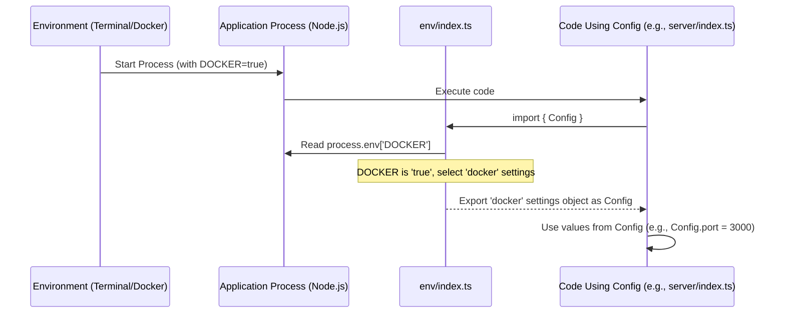

# Chapter 8: Configuration Management (Env Vars & Files)

In the previous chapter, [Shared Packages (Monorepo)](07_shared_packages__monorepo__.md), we learned how `cohbrgr` organizes code into shared `packages/` and specific `apps/` within a single repository (a monorepo). This makes sharing code like components and utilities super easy.

Now, let's think about how these different applications, like `shell` and `content`, know how to talk to each other and how they should behave depending on where they are running.

## What Problem Does This Solve? Different Instructions for Different Situations

Imagine building a model car kit. The kit might come with two sets of instructions:
1.  **Quick Test Build:** Simple steps, maybe using temporary glue, just to see how the main parts fit together quickly on your workbench.
2.  **Final Detailed Build:** More complex steps, involving painting parts before assembly, using permanent glue, and adding decals for the final display piece.

Our web applications are similar. They need different "instructions" (configurations) depending on the situation (environment):

*   **Local Development:** When you're running the code on your own computer (`npm start`), the `shell` app needs to know that the `content` app is running nearby (e.g., at `http://localhost:3001`). The server might run on a test port like `3030`.
*   **Production/Docker:** When the application is built and deployed for real users (often using Docker containers), the `shell` app needs the *real* internet address (URL) of the `content` app. The server should run on its standard port (like `3000`). Static files (CSS, JS) might be located in a different path inside the Docker container.

If the `shell` app always uses the `localhost` address, it won't be able to find the `content` app when deployed online! We need a way to manage these settings dynamically. This is **Configuration Management**.

In `cohbrgr`, we manage these settings using:
*   **Environment Variables:** Like small sticky notes passed to the application from the outside environment (e.g., your terminal or a Docker container).
*   **Dedicated Configuration Files:** Specific files (`env/index.ts`) within each app that read these sticky notes and provide the correct settings.

## Key Concepts

1.  **Environments:** The context where the code is running (e.g., "local development" on your machine, "production" on a live server, potentially inside a "Docker" container).
2.  **Configuration Values:** Specific settings that change based on the environment. Examples:
    *   Network port the server should listen on (e.g., 3000 vs 3030).
    *   URL of the `content` microfrontend (e.g., `http://localhost:3001` vs. `https://cohbrgr-content-o44imzpega-oa.a.run.app/`).
    *   Path to find static files like CSS/JS (e.g., `/dist` vs. `/apps/shell/dist`).
3.  **Environment Variables (`process.env`)**:
    *   These are variables set *outside* the application code, in the environment where the application process runs.
    *   Node.js makes these available through the global `process.env` object.
    *   Think of them as external signals or flags. In `cohbrgr`, a key signal is `process.env['DOCKER']`. If this variable is set (e.g., to `'true'`), the application knows it's running inside Docker.
4.  **Configuration Files (`apps/*/env/index.ts`)**:
    *   Each application (`shell`, `content`) has an `env/index.ts` file.
    *   This file defines different sets of configuration values (e.g., one set for `local`, one for `docker`).
    *   It checks environment variables (like `process.env['DOCKER']`) to decide which set of values to export for the rest of the application to use.

## How `cohbrgr` Uses Config Management

Let's see how this works in practice.

**1. Defining Configurations in `env/index.ts`**

Both the `shell` and `content` apps have a similar file structure for their configuration.

```typescript
// Simplified from apps/shell/env/index.ts

// Define settings for different environments
const internalConfig = {
    local: { // Settings for local development
        port: 3000, // Default port (adjusted to 3030 by server for dev)
        location: 'http://localhost',
        staticPath: '/dist',
    },
    docker: { // Settings when running in Docker/Production
        port: 3000,
        location: 'https://cohbrgr-o44imzpega-oa.a.run.app/', // Real URL!
        staticPath: '/apps/shell/dist', // Path inside Docker
    },
};

// Check the 'DOCKER' environment variable
// Export the 'docker' settings if DOCKER is set, otherwise 'local'
export const Config = process.env['DOCKER']
    ? internalConfig.docker
    : internalConfig.local;
```

*   We create an object `internalConfig` with nested objects (`local`, `docker`) holding specific settings for each environment.
*   The crucial line `export const Config = process.env['DOCKER'] ? ...` checks if the `DOCKER` environment variable exists.
*   If `DOCKER` is set, it exports the `internalConfig.docker` object as `Config`.
*   If `DOCKER` is *not* set, it exports the `internalConfig.local` object as `Config`.

The `apps/content/env/index.ts` file looks very similar but has its own specific ports and URLs:

```typescript
// Simplified from apps/content/env/index.ts
export const internalConfig = {
    local: {
        port: 3001, // Content runs on 3001 locally
        location: 'http://localhost',
        staticPath: '/dist',
    },
    docker: {
        port: 3001,
        location: 'https://cohbrgr-content-o44imzpega-oa.a.run.app/', // Prod URL
        staticPath: '/apps/content/dist',
    },
};

// Same logic: check DOCKER env var
export const Config = process.env['DOCKER']
    ? internalConfig.docker
    : internalConfig.local;
```

**2. Using the Configuration**

Other parts of the application can now import `Config` from the corresponding `env/index.ts` file and use the settings without needing to know *which* environment they are running in. The `env/index.ts` file handles that decision.

*   **Example: Server Port (`apps/shell/src/server/index.ts`)**

    The Express server needs to know which port to listen on.

    ```typescript
    // Simplified from apps/shell/src/server/index.ts
    import { Config } from '@cohbrgr/shell/env'; // Import config
    import { Logger } from '@cohbrgr/utils';
    // ... other imports

    const isProduction = process.env['NODE_ENV'] === 'production';
    // Use the port from the loaded Config, adjust for local dev
    const defaultPort = isProduction ? Config.port : Config.port + 30;
    const port = process.env['PORT'] || defaultPort;

    // ... setup express app ...

    app.listen(port, () => { // Start server on the calculated port
        Logger.info(`Server started at http://localhost:${port}`);
    });
    ```
    *   It imports `Config` from `@cohbrgr/shell/env`.
    *   It uses `Config.port` to determine the base port number. If running locally (not production), it adds 30 (so 3000 becomes 3030) for the development server.

*   **Example: Module Federation URL (`apps/shell/build/configs/rspack.federated.config.ts`)**

    The [Build System (Rspack Configuration)](06_build_system__rspack_configuration__.md) for the `shell` app needs to know the URL of the `content` app to set up [Module Federation (via Rspack)](02_module_federation__via_rspack__.md).

    ```typescript
    // Simplified from apps/shell/build/configs/rspack.federated.config.ts
    import { Config as ContentConfig } from '@cohbrgr/content/env'; // Import CONTENT's config!
    import { ModuleFederationPlugin } from '@module-federation/enhanced/rspack';

    // Construct the URL based on CONTENT's config and environment
    const contentPort = /* logic to maybe add +30 for dev */;
    const contentUrl =
        process.env['DOCKER'] === 'true'
            ? ContentConfig.location // Use Docker/Prod URL from content config
            : `${ContentConfig.location}:${contentPort}/`; // Use Local URL:Port

    const getHostOptions = (isServer: boolean) => ({
        remotes: { // Tell shell where to find content
            content: `content@${contentUrl}${isServer ? 'server' : 'client'}/remoteEntry.js`,
        },
        // ... other options
    });

    // ... rest of the Rspack config using getHostOptions ...
    ```
    *   Notice it imports `Config as ContentConfig` from `@cohbrgr/content/env` - yes, the shell's build process reads the *content* app's configuration file! This is possible thanks to the [Monorepo](07_shared_packages__monorepo__.md) structure.
    *   It uses `ContentConfig.location` and checks `process.env['DOCKER']` to build the correct `contentUrl`.
    *   This `contentUrl` is then used in the `ModuleFederationPlugin` configuration to tell the `shell` where to find the remote `content` application.

## Internal Implementation: How Settings are Loaded

The process is quite straightforward:

1.  **Start Process:** The Node.js process starts (e.g., running the server or the build script). The environment (your terminal, Docker, a deployment script) might set environment variables like `DOCKER=true` or `NODE_ENV=production`.
2.  **Import Config:** Code that needs configuration (like `server/index.ts` or `rspack.federated.config.ts`) imports the `Config` object from the relevant `env/index.ts` file.
3.  **Check Environment:** The code inside `env/index.ts` executes. It reads `process.env['DOCKER']`.
4.  **Select Settings:** Based on the value of `process.env['DOCKER']`, it chooses either the `local` or `docker` set of configuration values.
5.  **Export Settings:** It exports the chosen set as the `Config` object.
6.  **Use Settings:** The code that imported `Config` now uses the values from the object (e.g., `Config.port`, `Config.location`).

Here's a diagram illustrating this:



This simple mechanism ensures that the application automatically adapts its settings based on the environment variable signal (`DOCKER`), without needing complex logic scattered throughout the codebase.

## Conclusion

Configuration Management in `cohbrgr` allows the application to behave correctly in different environments (like local development vs. Docker/production).

Key takeaways:
*   Different environments require different settings (ports, URLs, paths).
*   **Environment Variables** (like `process.env['DOCKER']`) act as external signals to indicate the current environment.
*   Dedicated **Configuration Files** (`apps/shell/env/index.ts`, `apps/content/env/index.ts`) define sets of configurations for each environment.
*   These files read environment variables to choose and export the *correct* set of configurations as a `Config` object.
*   Other parts of the application simply import and use this `Config` object, getting the right settings automatically.
*   This keeps configuration logic centralized and makes it easy to adapt the application to different deployment scenarios, which is crucial for connecting microfrontends like `shell` and `content` correctly.

Congratulations! You've reached the end of this tutorial series, covering the core concepts behind the `cohbrgr` project, from its [Microfrontend Architecture (Shell & Content)](01_microfrontend_architecture__shell___content__.md) and [Module Federation (via Rspack)](02_module_federation__via_rspack__.md) to its [Server-Side Rendering (SSR) Pipeline (Shell)](04_server_side_rendering__ssr__pipeline__shell__.md), [Build System (Rspack Configuration)](06_build_system__rspack_configuration__.md), and how it manages code sharing ([Shared Packages (Monorepo)](07_shared_packages__monorepo__.md)) and environment settings. We hope this gives you a solid foundation for understanding and working with the project!

---

Generated by [AI Codebase Knowledge Builder](https://github.com/The-Pocket/Tutorial-Codebase-Knowledge)