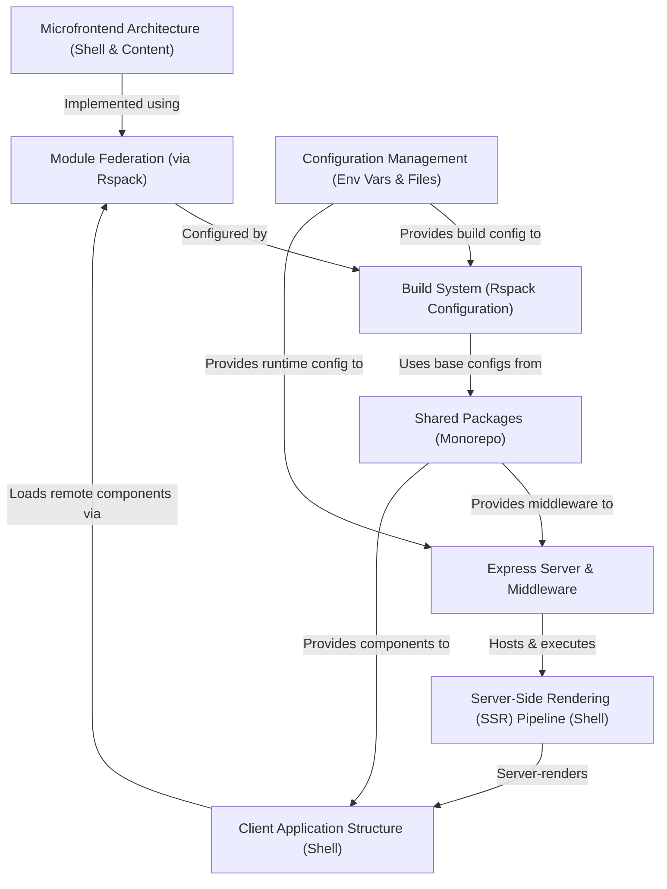

# Tutorial: cohbrgr

This project is an experimental web application featuring a **Microfrontend Architecture**. It consists of a main *shell* application and a separate *content* application.
The *shell* uses **Server-Side Rendering (SSR)** with Node.js and Express to deliver the initial HTML quickly.
The different parts (*shell* and *content*) share code and components at runtime using **Module Federation**, allowing them to be developed and deployed independently.
It's built using React, TypeScript, and Rspack, organized within a *monorepo*.

**Source Repository:** [None](None)

## Chapters

1. [Microfrontend Architecture (Shell & Content)
](01_microfrontend_architecture__shell___content__.md)
2. [Module Federation (via Rspack)
](02_module_federation__via_rspack__.md)
3. [Client Application Structure (Shell)
](03_client_application_structure__shell__.md)
4. [Server-Side Rendering (SSR) Pipeline (Shell)
](04_server_side_rendering__ssr__pipeline__shell__.md)
5. [Express Server & Middleware
](05_express_server___middleware_.md)
6. [Build System (Rspack Configuration)
](06_build_system__rspack_configuration__.md)
7. [Shared Packages (Monorepo)
](07_shared_packages__monorepo__.md)
8. [Configuration Management (Env Vars & Files)
](08_configuration_management__env_vars___files__.md)

---

Generated by [AI Codebase Knowledge Builder](https://github.com/The-Pocket/Tutorial-Codebase-Knowledge)